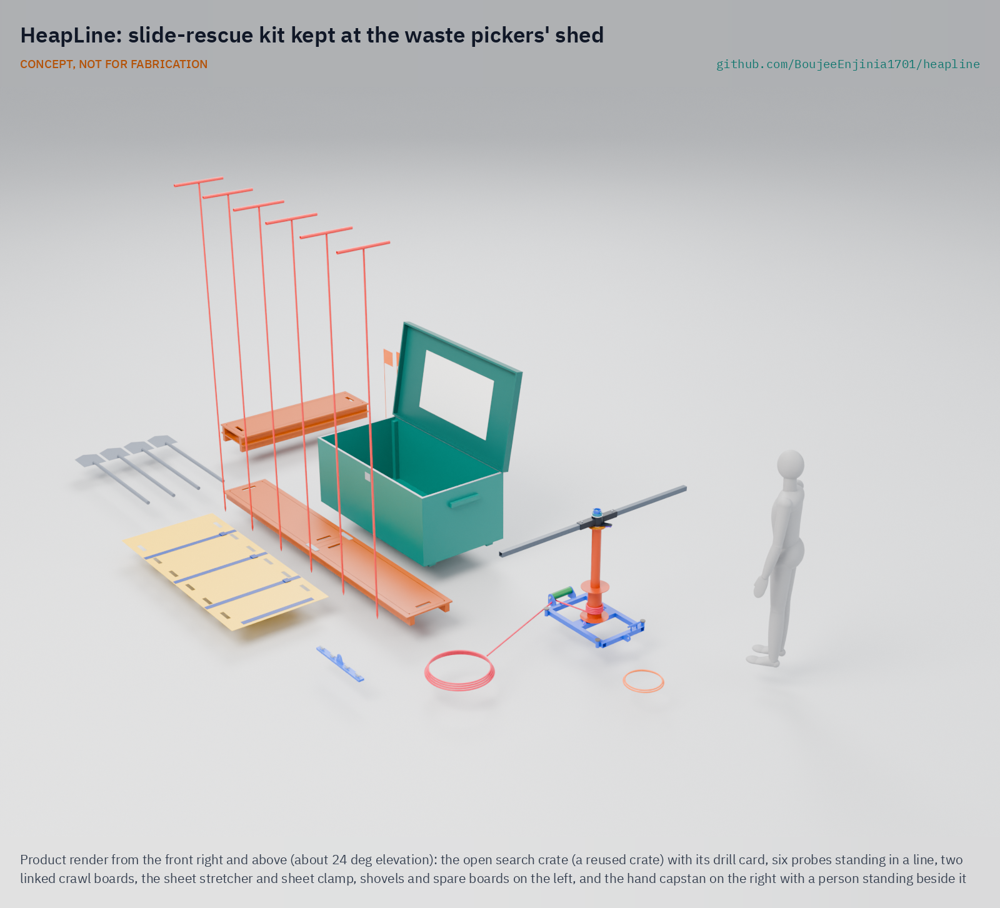
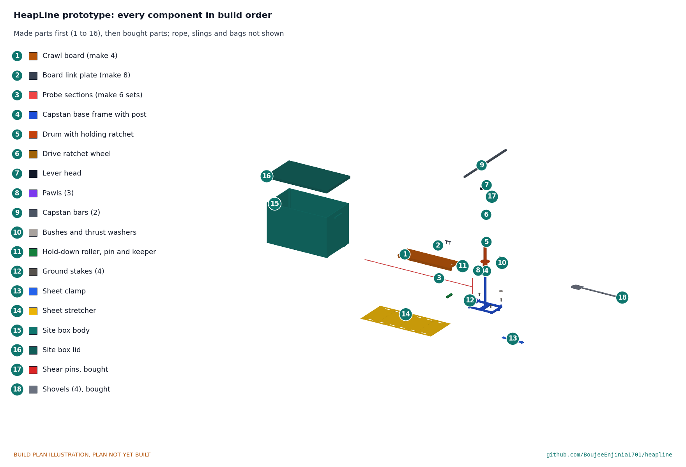

# HeapLine

     

**Area:** Situational field hardware · **TRL:** 3 of 9 (proof of concept on paper; constructable design) · **Value-engineering target:** USD 1,800; estimated parts cost USD 1,374 for the host site (USD 827 for each other site) · **Difficulty:** 3 of 5

Keeps a slide-rescue kit at the pickers' shed so they can search, probe and dig safely in the first minutes.

> CONCEPT, NOT FOR FABRICATION. HeapLine is a TRL 3 design on paper: it has not been built or tested.

## Concept rationale

HeapLine is a slide-rescue kit kept in a locked box at the waste pickers' shed or cooperative office. It holds probes, crawl boards, shovels, a hand capstan and a sheet stretcher. After a slide, pickers carry it out, post a lookout on the slope above, probe along the likely burial line, dig from crawl boards so they do not sink or trigger another slide, and move casualties out on the stretcher. A plain stop rule, printed on the lid, tells everyone when to pull back.

The model is companion rescue in avalanches, where survivors on the spot search at once rather than waiting for help, because survival falls quickly with burial time. The kit is cheap and made from common materials so cooperatives, municipalities and NGOs can stock every site. It is published as an open engineering reference, not certified rescue equipment, and it never replaces making the dumpsite itself safe.

## Burning platform

Dumpsite slides kill people who live and work on and beside the waste. The March 2017 landslide at Koshe in Addis Ababa killed 116 people ([UN-Habitat, 2019](https://unhabitat.org/news/05-jul-2019/after-the-tragic-landslide-that-killed-116-koshe-landfill-in-addis-ababa-is-safer)), at a site where 500 to 600 waste pickers worked every day ([IDS, 2017](https://www.ids.ac.uk/opinions/recognise-informal-waste-pickers-to-avoid-future-disasters-like-koshe/)). On 9 August 2024, after heavy rain, the Kiteezi landfill in Kampala collapsed onto homes; 35 bodies had been recovered by 16 August ([Wikipedia](https://en.wikipedia.org/wiki/Kiteezi_Landfill)), dozens were still missing and about 1,000 people were displaced ([StrongMinds](https://strongminds.org/kiteezi-landslide-highlights-urgent-need-for-mental-health-care-in-climate-disaster-responses/)). About 800 to 1,000 people scavenged at Kiteezi ([Wikipedia](https://en.wikipedia.org/wiki/Kiteezi_Landfill)).

These are not isolated events: the same account of Kiteezi lists failures at Naucalpan in Mexico in 2023, Meethotamulla in Sri Lanka and Koshe in 2017, and Guatemala City in 2008 ([Eos Landslide Blog, 2024](https://eos.org/thelandslideblog/kiteezi-1)). More than 15 million people are reported to live and work in communities that depend on dumpsites, and that is thought to be an underestimate ([International Samaritan, citing ISWA](https://intsam.org/about-garbage-dump-communities/)). Reporting on Kiteezi described rescue efforts as rudimentary ([The Independent, Uganda, 2024](https://www.independent.co.ug/cover-story-lets-not-waste-kiteezi-garbage-tragedy/)).

## Where it could be used

### By industry

| Industry | Use |
| --- | --- |
| Informal waste picking and recycling cooperatives | Kit and drill kept at the shed for the first minutes after a slide |
| Municipal solid waste management | A low-cost emergency measure for open dumps awaiting closure or rehabilitation |
| Disaster risk reduction and civil protection | Community first-responder training for dumpsite neighbourhoods |
| Humanitarian and development NGOs | Stocking kits and training at sites where people live on or beside waste |
| Small quarries, spoil heaps and mine waste | The same probe, board and dig method on other unstable heaps |

### By country or region

| Country or region | Why it matters there |
| --- | --- |
| Ethiopia | The 2017 Koshe landslide killed 116 people ([UN-Habitat, 2019](https://unhabitat.org/news/05-jul-2019/after-the-tragic-landslide-that-killed-116-koshe-landfill-in-addis-ababa-is-safer)). |
| Uganda | The 2024 Kiteezi collapse killed at least 35 people and displaced about 1,000 ([StrongMinds](https://strongminds.org/kiteezi-landslide-highlights-urgent-need-for-mental-health-care-in-climate-disaster-responses/)). |
| Sri Lanka and Mexico | Dumpsite landslides at Meethotamulla (2017) and Naucalpan (2023) show the hazard outside Africa ([Eos Landslide Blog, 2024](https://eos.org/thelandslideblog/kiteezi-1)). |
| Guatemala | A dumpsite failure in Guatemala City in 2008 ([Eos](https://eos.org/thelandslideblog/kiteezi-1)), at a site where about 2,000 recyclers work ([International Samaritan](https://intsam.org/about-garbage-dump-communities/)). |
| Jamaica | About 3,000 recyclers work at the Riverton City dump in Kingston ([International Samaritan](https://intsam.org/about-garbage-dump-communities/)). |

## What sparked the idea

The spark was the Kiteezi collapse in Kampala on 9 August 2024. After heavy rain the waste slope failed onto homes, killing at least 35 people, with dozens more missing ([StrongMinds](https://strongminds.org/kiteezi-landslide-highlights-urgent-need-for-mental-health-care-in-climate-disaster-responses/)), and coverage described rescue efforts as rudimentary ([The Independent, Uganda, 2024](https://www.independent.co.ug/cover-story-lets-not-waste-kiteezi-garbage-tragedy/)). A 2021 study had already recommended closing the site ([Eos Landslide Blog](https://eos.org/thelandslideblog/kiteezi-1)). The people closest to the victims were neighbours and pickers who knew the site, and they had nothing to dig with that was safer than their hands.

## Problem

When a dumpsite slope fails, waste pickers and neighbours are the first on the scene and start digging with their hands, on unstable waste, with no tools and no plan. They need a simple rescue kit and drill kept on site for the first minutes.

Full problem statement: [docs/01-problem.md](docs/01-problem.md)

## Concept

A slide-rescue kit kept at the waste pickers' shed (probes, crawl boards, shovels, capstan and sheet stretcher); after a dumpsite slide, pickers carry it out, probe and dig for buried people in the first minutes under a lookout and a clear stop rule.

Full design precis: [docs/02-concept.md](docs/02-concept.md) · Requirements: [docs/03-requirements.md](docs/03-requirements.md) · Calculations: [docs/04-calcs/01-sizing.md](docs/04-calcs/01-sizing.md) · Prototype build plan: [docs/05-build-plan.md](docs/05-build-plan.md) · Design decisions: [docs/06-design-decisions.md](docs/06-design-decisions.md) · 3D viewer: [media/viewer.html](media/viewer.html)

On paper (HPL-CAL-001): the first probe line starts about 4.6 minutes after the alarm; the hand capstan pulls 5 kN with four people at 114 N each, and a shear pin caps the rope at about 6.4 kN; with 18 mm probe tips, one person reaches 2.6 m in loosened debris and two people in stiffer debris; crawl boards sink 44 mm under a kneeling searcher. Following Amish's decisions of 2026-10-03, four people haul the stretcher on debris, the kit goes out in two waves of about 22 kg a person, and one capstan set is shared by neighbouring sites, so each site's search kit costs USD 827 against the restated USD 850 (R9). How far apart sharing sites may be is open in [docs/06-design-decisions.md](docs/06-design-decisions.md).

## Key components

- Search crate: a reused timber crate refitted on skids at every site, combination padlock, drill card and stop rule on the lid; the shared capstan set has its own crate at the host site
- Probes: six, each three 1 m steel sections on spigots with a blunt 18 mm tip
- Crawl boards: four plywood boards on battens, linked end to end
- Shovels: four, long handled
- Hand capstan: pumped friction capstan with a drive ratchet, two holding pawls and a shear pin; 14 mm rope, sling to a sound anchor, sheet clamp
- Sheet stretcher: roll-up 2 mm HDPE sheet with straps
- Lookout kit: whistles, vests, marker wands, safe-zone sign
- Lighting and PPE: AA head lamps (no lithium cells); gloves, boots, masks and glasses from the cooperative's stock

## Building the prototype

The build plan takes a capable maker from plywood, steel tube, plate and HDPE sheet to one complete site kit, with a making sketch for each of the sixteen made components, close-ups of the eleven joints that need one and fifteen illustrated steps. The boards and box are glued and screwed; the capstan, probes and clamp are cut, welded and profile cut; the rope, lifting gear, shovels and protective equipment are bought. It is a plan, not yet built; building and testing to it is TRL 4 work. See [docs/05-build-plan.md](docs/05-build-plan.md).

## Safety

> Rescue on unstable ground: published as an open engineering reference, not certified rescue equipment.
>
> A second slide can bury the rescuers. Never search without a lookout, and obey the stop rule every time.
>
> Call the fire service and emergency services at once; the kit is for the minutes before they arrive.
>
> Landfill gas can be flammable or toxic; no naked flames or smoking at the search.
>
> Sharp waste and infection risk: gloves and boots are part of the kit.
>
> The kit does not make a dumpsite safe; it must not be used to argue against closure or rehabilitation.
>
> The capstan rope stores energy: nobody in the line of a loaded rope, never lift or pull on a person, and fit only the specified 6 mm S275 shear pin.
>
> This design is published as an open engineering reference. It is not certified equipment.

## Repository layout

| Folder | Contents |
| --- | --- |
| `docs/` | Problem, concept, requirements, calculations and design decisions |
| `cad/src/` | build123d Python source, the source of truth for all geometry |
| `cad/step/`, `cad/stl/` | Exported models for FreeCAD, other CAD tools and printing |
| `cad/drawings/` | 2D sketches and dimensioned drawings |
| `bom/` | Bill of materials |
| `electronics/` | KiCad schematics and PCB layouts |
| `firmware/` | Microcontroller code |
| `media/` | Renders, perspectives and photos |
| `build-log/` | Dated prototyping notes |

## Documentation

Controlled documents follow the portfolio [documentation standard](.kit/STANDARDS.md). Each carries a document ID (HPL-PRC-001 for the precis), a version and a revision history. Branded PDFs are built with `python .kit/render.py` and attached to GitHub Releases when a document is tagged, for example `HPL-PRC-001/v1.0`.

## Credits

Designed by Amish Chadha at Design Molecule Labs. See [CONTRIBUTORS.md](CONTRIBUTORS.md) for roles. To cite this design, use [CITATION.cff](CITATION.cff) (GitHub shows it as "Cite this repository").

AI assistance (Claude) was used to accelerate prototype documentation and first-pass research. Design direction and all decisions are Amish Chadha's, recorded in this repository's decision records (`docs/decisions/`).

## Licenses

- **Hardware** (CAD, drawings, BOM, electronics): [CERN-OHL-S v2](LICENSE)
- **Software** (firmware, scripts, notebooks): [MIT](LICENSE-SOFTWARE)

A project of the [Design Molecule](https://designmolecule.com) lab.
