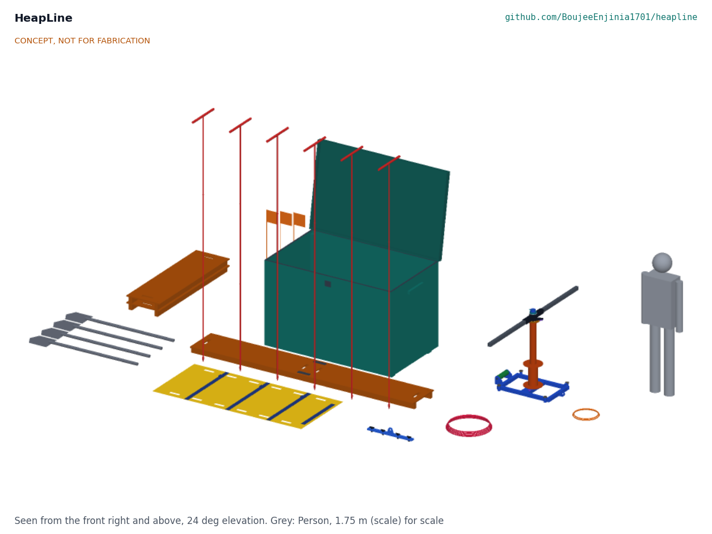
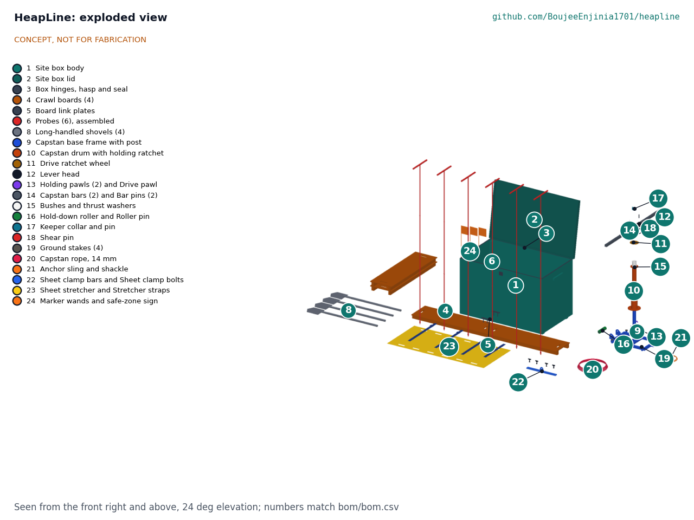
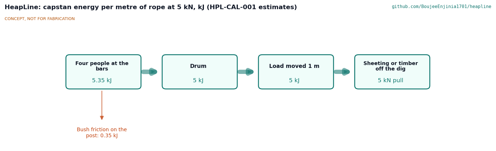

# HeapLine design precis

Keeps a slide-rescue kit at the pickers' shed so they can search, probe and dig safely in the first minutes.

*Figure 1. Concept render: the open site box, six probes standing in a line, two linked crawl boards with the sheet stretcher and sheet clamp in front, shovels and spare boards on the left, and the hand capstan on the right with a 1.75 m person beside it.*

## Summary

HeapLine is a slide-rescue kit kept in a locked plywood box at the waste pickers' shed. It holds six sectional steel probes, four linked crawl boards, four shovels, a hand capstan with its rope and anchor sling, a sheet clamp, a roll-up sheet stretcher, a lookout kit, lamps and protective equipment, with the drill card and stop rule printed on the lid. After a slide, four people carry the search kit out, post a lookout, lay boards onto the debris, probe in a line and dig from the boards; a second group brings the capstan to pull sheeting and timber off the dig from firm ground. On paper the first probe line starts 4.6 minutes after the alarm, the capstan gives 5 kN with four people at 114 N each, and the parts cost USD 1,599 against a USD 1,800 value-engineering target (HPL-CAL-001). It is an open engineering reference, not certified rescue equipment, and it never replaces making the dumpsite safe.

## How it works

1. **Alarm and lookout.** The first person at a slide raises the alarm and calls the fire service and emergency services. Someone runs to the shed, opens the combination padlock and hands out the search kit. Before anyone steps onto the debris, a lookout in a vest stands on stable ground to the side of the slide with a whistle and watches the slope above.
2. **Boards.** Searchers lay crawl boards from firm ground onto the debris and join them end to end with link plates. They kneel and walk only on the boards, which spread their weight and bridge voids.
3. **Probe line.** Up to six searchers stand on the boards about 0.5 m apart and push probes straight down, three 1 m sections joined on spigots, 2.6 m usable. A strike that feels soft and gives is marked with a flagged wand.
4. **Dig.** Searchers dig at each mark from the boards with long-handled shovels, from the downslope side, keeping a board between them and the hole's edge.
5. **Capstan.** Where sheeting, timber or heavy debris lies over a mark, a second group sets the capstan on firm ground, stakes it and slings it to a sound tree, vehicle or column. The sheet clamp or a choker sling goes on the load, the rope runs to the capstan, and four people pump the two bars through quarter turns while a fifth tails the rope. Two pawls hold the drum whenever the bars stop; a 6 mm shear pin releases at about 6.4 kN so the rope, the capstan and the anchor are never overloaded. The capstan only pulls loads sideways away from the dig; it never lifts and never pulls on a person.
6. **Move the casualty.** The casualty is slid onto the sheet stretcher, strapped, and pulled back along the boards by two to four haulers to a pickup point on firm ground.
7. **Stop rule.** On any stop signal everyone leaves the debris along the boards to the marked safe zone, to the side of the slide path and never below it, and waits for the lookout's all clear or for the formal responders.

*Figure 2. Exploded view; the capstan parts are lifted off their post. Numbers are bill of materials lines.*

## Components

*Table 1. Main components (line numbers from `bom/bom.csv`).*

| BOM | Component | What it is |
| --- | --- | --- |
| 1, 2, 3 | Site box | 18 mm exterior plywood, 1700 x 1020 x 1060 mm on skids, lid with a 48 mm skirt over a seal, three strap hinges, hasp and combination padlock; 104 kg; stays at the shed |
| 4, 5 | Crawl boards | Four 1500 x 450 mm boards, 15 mm plywood on two 45 x 70 mm battens, 9.7 kg each; joined by link plates with two 12 mm pins |
| 6, 7 | Probes | Six probes, each three 1 m sections of 16 x 2.0 mm steel tube on spigots with R-clips, a 22 mm tip rounded to 3 mm and a 450 mm T handle; 3.07 m, 3.1 kg |
| 8 | Shovels | Four long-handled round-point shovels |
| 9 to 18 | Hand capstan | Base frame with a fixed post; drum turning on acetal bushes with a 24-tooth holding ring and two pawls; drive ratchet joined to the drum only by the 6 mm shear pin; lever head with a drive pawl and two bar sockets; two 900 mm bars; hold-down roller; keeper collar |
| 19 | Stakes | Four 25 mm stakes and a club hammer; they stop the frame turning, they are not the anchor |
| 20, 21 | Rope and lifting gear | 30 m of 14 mm polyester double braid (40 kN); two 2,000 kg round slings and three shackles |
| 22 | Sheet clamp | Two 50 x 8 mm flats with four wing bolts and a shackle lug; grips plastic sheeting |
| 23 | Sheet stretcher | 2 mm HDPE sheet 2000 x 900 mm with hand slots and three straps; rolls to 250 mm |
| 24 to 27 | Lookout kit, lighting, PPE, drill card | Whistles, vests, marker wands, safe-zone sign; AA lamps; gloves, boots, masks, glasses; drill card and stop rule on the lid |

## Key design choices

All decided under Amish's pre-approvals of 2026-10-03 (HPL-DDR-001 and HPL-DDR-002):

- **A pumped friction capstan.** The crew stands still and pumps two bars through a quarter turn; a drive ratchet turns the drum and two holding pawls keep it from running back. Nobody walks round it or steps over a rope at knee height, and the rope leaves under a roller 38 mm above the ground, level with the anchor sling, so it cannot tip.
- **A shear pin as the weakest link.** The rope, capstan, slings and anchor are all sized on 8 kN; the pin releases between 5.1 and 7.6 kN.
- **Sound anchors only.** A round sling to a tree, a parked vehicle or a structural column; never waste, never stakes alone. No sound anchor, no capstan.
- **Push, never drive, the probes.** A blunt tip and no hammer, so a probe cannot injure a buried person.
- **No lithium cells and no gas detector in the box.** Both would need upkeep the kit cannot assume; the rules cover the gap.
- **Everything packs.** The box is sized so the capstan stands in it assembled, bars off, and every item fits without clashes (checked in the model).

## First-order numbers

From HPL-CAL-001, on the constructable design:

*Table 2. First-order numbers.*

| Quantity | Value | Assumption |
| --- | --- | --- |
| Time from alarm to first probe line | 4.6 min | 100 m each way; 0.8 m/s carrying |
| Probe reach | 2.6 m in loosened debris; 1.8 m with two people in stiffer debris | Cone 0.4 or 1.0 MPa; sleeve 1 or 3 kPa |
| Board sinkage | 44 mm | 100 kg x 1.5 on very loose debris |
| Capstan force per person at 5 kN | 114 N | Four people, two on each bar |
| Shear pin release | 6.4 kN (5.1 to 7.6 kN) | S275 pin, plus or minus 20 % |
| Haul force on the stretcher, level debris | 510 N | Friction 0.5 |
| Heaviest carried item | 21.2 kg | Capstan frame with post |
| Carried kit | 151 kg | Search wave 86 kg, capstan wave 65 kg |
| Parts cost | USD 1,599 | Value-engineering target USD 1,800 |

*Figure 3. Energy per metre of rope at 5 kN (estimates from HPL-CAL-001).*

## Stop rule

Any one of these sends everyone off the debris along the boards to the safe zone at once:

1. The lookout's long whistle.
2. New cracks, bulging or movement on the slope above.
3. Water or mud flowing out of the debris.
4. Rain getting heavier.
5. A gas smell, smoke or hissing.
6. An order from the fire service, police or another formal responder.

## Patent design-arounds

From the preliminary patent, trademark and prior-art screen (not legal advice):

- Known collapse-rescue practice with no blocking patent found; publish dated drawings early as defensive disclosure.

## Shared blocks

- The SiltHaul hand capstan was considered and not used: it is limited to 2.5 kN and weighs about 48 kg (HPL-DDR-001, item 1).
- CalRig is the first candidate rig for the capstan proof loads and the shear pin release tests.

## Safety

> **Safety:** Rescue on unstable ground. HeapLine is published as an open engineering reference, not certified rescue equipment.
>
> A second slide can bury the rescuers. Never search without a lookout, and obey the stop rule every time.
>
> Call the fire service and emergency services at once; the kit is for the minutes before they arrive, and the search is handed over when they do.
>
> The capstan rope stores energy. Nobody stands in the line of a loaded rope or within 2 m of it; the capstan never lifts and never pulls on a person; only the specified 6 mm S275 shear pin is ever fitted; the tail is made fast on the cleat whenever hauling stops.
>
> Landfill gas can be flammable or toxic: no naked flames or smoking at the search.
>
> Sharp waste and infection risk: gloves and boots are part of the kit.
>
> The kit does not make a dumpsite safe; it must not be used to argue against closure or rehabilitation.

## Open questions

Decisions still open, including those for the requirements at risk (R2, R5, R8) and not met (R9), are kept in the design decisions register (`docs/06-design-decisions.md`).
