# HeapLine prototype build plan

**Plan, not yet built.** How to build the first proof-of-concept HeapLine kit, component by component. Building and testing to it is TRL 4 work. Decisions still to be made are kept in the design decisions register (`docs/06-design-decisions.md`), not here.

> **Safety:** HeapLine is a rescue kit for unstable ground and its capstan stores energy in a loaded rope. It is published as an open engineering reference, not certified rescue equipment. The safety stops in section 6 apply to every load test and every drill; no drill is ever run on a real slide or on a slope that could move.

## 1. What you are building

*Figure 1. Every component in build order: made parts first, then bought parts.*

One complete site kit: a plywood site box on skids, four crawl boards with eight link plates, six three-section probes, a hand capstan (base frame with a fixed post, drum, drive ratchet, lever head, pawls, bars, bushes, hold-down roller, keeper and stakes), a sheet clamp and a sheet stretcher, plus bought shovels, rope, slings and shackles, lookout kit, lamps and protective equipment. Sixteen components are made: the steel parts by cutting, drilling and welding (MIG or stick), the pawls and ratchets by laser or plasma profile cutting, the bushes by turning acetal, the boards and box by cutting, gluing and screwing exterior plywood, and the stretcher by cutting HDPE sheet and riveting webbing. The parts cost about USD 1,599 from the bill of materials.

## 2. What changed to make it buildable

*Table 1. Changes from the concept (HPL-DDR-002).*

| Component | The concept had | The buildable design has | Why |
| --- | --- | --- | --- |
| Capstan base | A capstan on a ground anchor, no base | A 700 x 440 mm tube frame with a centre member, stake tubes, roller cheeks, an anchor eye and a tail cleat | Something to carry the post and take the anchor and stakes |
| Post | Not defined | A 60.3 mm tube passing through the centre member, welded at its top and bottom faces (Figure 9) | The two welds carry the bending from the rope |
| Rope lead | Rope leaving the drum about 130 mm up | A hold-down roller takes it down to 38 mm, level with the anchor eye (Figure 20) | The capstan cannot tip; the rope lies along the ground |
| Drum and head | Bars fixed to a drum, walked round | Drum and lever head turn on acetal bushes on the fixed post; the head drives the drum through a ratchet, pumped through a quarter turn | Nobody walks round or steps over a rope |
| Shear pin | Not placed | 6 mm pin joining the drive ratchet to the drum's top flange (Figure 12) | The only path for the drive; it limits the rope tension |
| Pawls | Not drawn | Noses just past a tooth face, pivots along the tangent (Figure 11) | They clear the teeth they ride over |
| Keeper | None | Collar and cross pin on the post top | Nothing slides off when carried |
| Probes | Sectional, joint not defined | Spigot joints with R-clips; tube ends bear; blunt 22 mm tip (Figures 6 and 7) | The push goes through the tube; the tip cannot cut |
| Crawl boards | Loose boards | Boards on two battens joined by pinned link plates (Figure 3) | Boards stay in line on the debris |
| Site box | A box for the kit | A 1700 x 1020 x 1060 mm box sized so everything packs, capstan upright (Step 11) | The concept box could not hold the capstan or the boards |
| Sheet clamp | None | A bolted two-bar clamp with a shackle lug (Figure 24) | Something to grip plastic sheeting |

## 3. Making the components

Sizes are in millimetres. Weld with MIG, or with 2.5 mm stick electrodes on the 2 and 3 mm walls. Prime and paint every steel part after making it, except the bores and the pin holes.

### 3.1 Crawl boards (make 4)

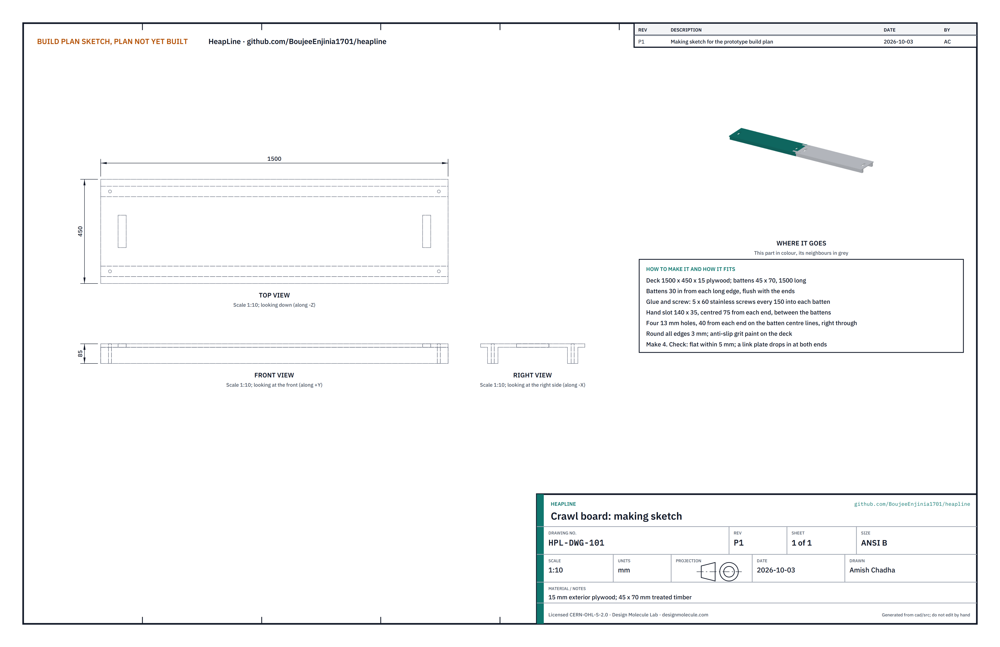

*Figure 2. Crawl board making sketch (HPL-DWG-101).*

**What it is and what it is made from.** The board searchers kneel and walk on. 15 mm exterior plywood 1500 x 450; two 45 x 70 treated softwood battens 1500 long; 5 x 60 stainless screws; exterior glue; anti-slip grit paint.

**How to make it.**

1. Cut the deck 1500 x 450 and round all its edges to about 3 mm.
2. Cut a hand slot 140 x 35 centred on the deck's width, its near edge 75 from each end.
3. Glue and screw the battens under the deck on their 70 mm edge, 30 in from each long edge and flush with both ends, screws every 150.
4. Drill four 13 mm holes right through deck and batten, 40 from each end on the batten centre lines.
5. Paint the deck with anti-slip grit paint and seal every cut edge.

**How it fits the parts next to it.**

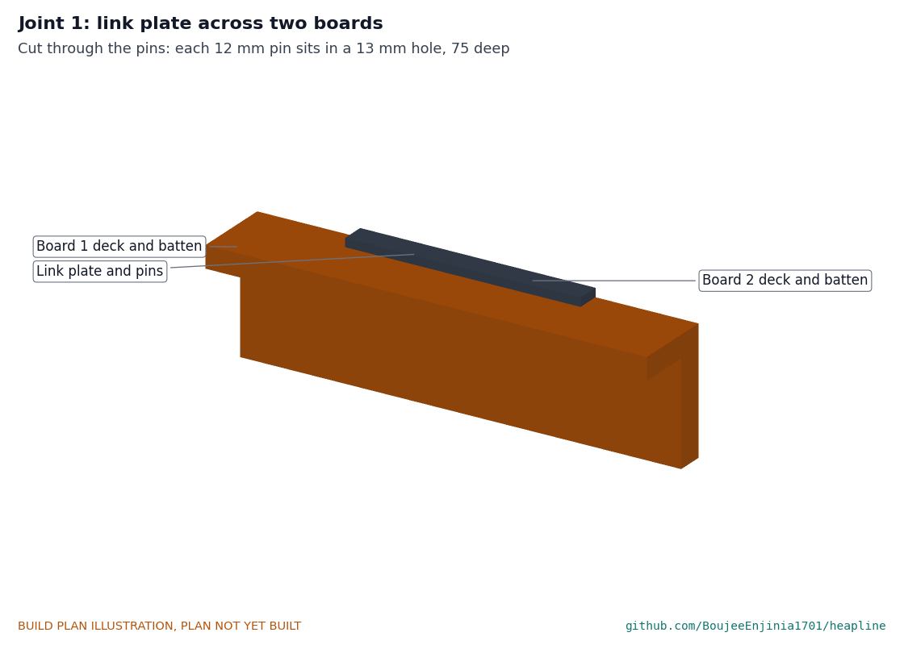

*Figure 3. Joint 1, cut through the pins. Two boards butt end to end; a link plate lies on the decks over each batten line and its two 12 mm pins drop into the 13 mm holes, 75 deep.*

**Check before moving on.** The board lies flat within 5 mm; a link plate drops into the holes at either end.

### 3.2 Board link plates (make 8)

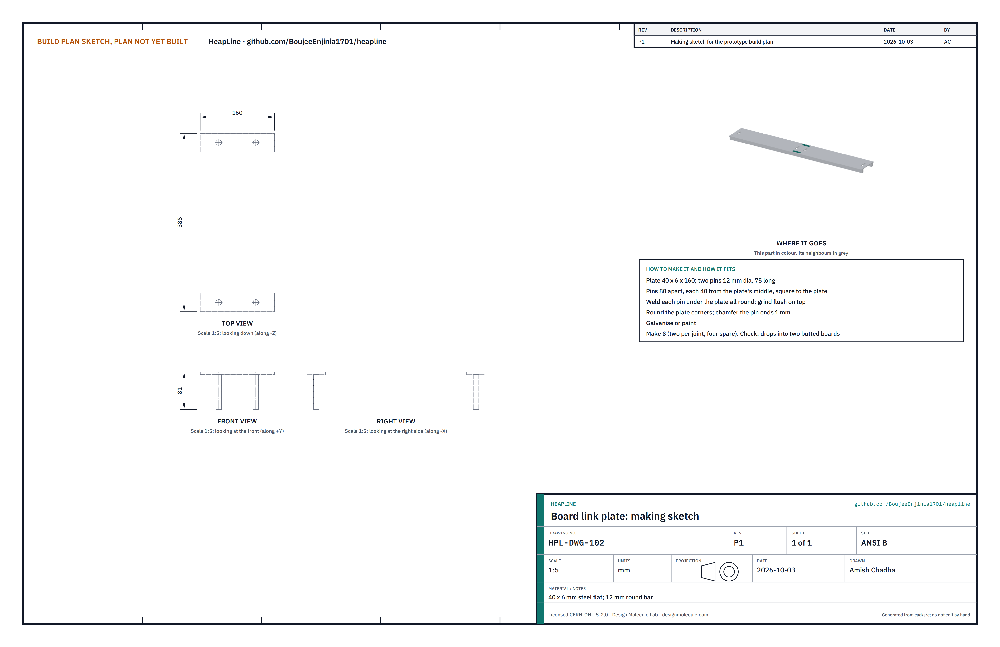

*Figure 4. Link plate making sketch (HPL-DWG-102).*

**What it is and what it is made from.** The plate that holds two boards in line. 40 x 6 steel flat 160 long; 12 mm round bar.

**How to make it.**

1. Cut the plate and round its corners.
2. Cut two pins 75 long and chamfer their ends.
3. Weld the pins square under the plate, 80 apart (40 each side of the middle), and grind the welds flush on top.
4. Galvanise or paint.

**How it fits the parts next to it.** See Figure 3: one plate on each batten line of a joint.

**Check before moving on.** Each plate drops into two butted boards without forcing.

### 3.3 Probes (make 6 sets of three sections)

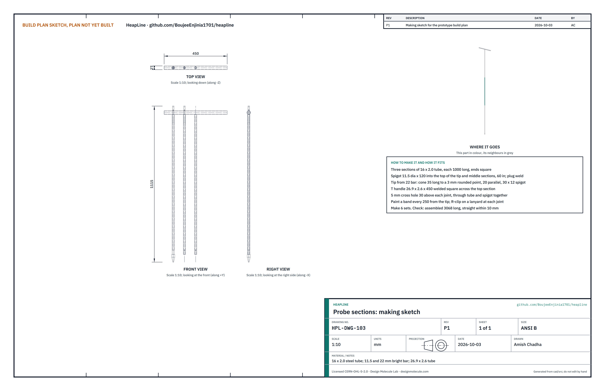

*Figure 5. Probe sections making sketch (HPL-DWG-103), sections drawn side by side.*

**What it is and what it is made from.** A 3.07 m probe in three sections that join on spigots. 16 x 2.0 steel tube; 11.5 mm and 22 mm bright bar; 26.9 x 2.6 tube for the handle; R-clips on lanyards.

**How to make it.**

1. Cut three tubes 1000 long, ends square and deburred.
2. Turn the tip from 22 mm bar: a 35 long cone ending in a 3 mm rounded point, 20 parallel, and a 12 mm spigot 30 long. Push the spigot into one tube and plug weld it. This is the tip section.
3. Cut two spigots of 11.5 mm bar 120 long. Push one 60 into the top of the tip section and one into the top of the middle section; plug weld.
4. Weld the 450 handle tube square across the top of the third tube.
5. Fit each upper section over its spigot, ends tight, and drill a 5 mm hole through tube and spigot together, 30 above the joint.
6. Paint a band every 250 from the tip, so the depth can be read.

**How it fits the parts next to it.**

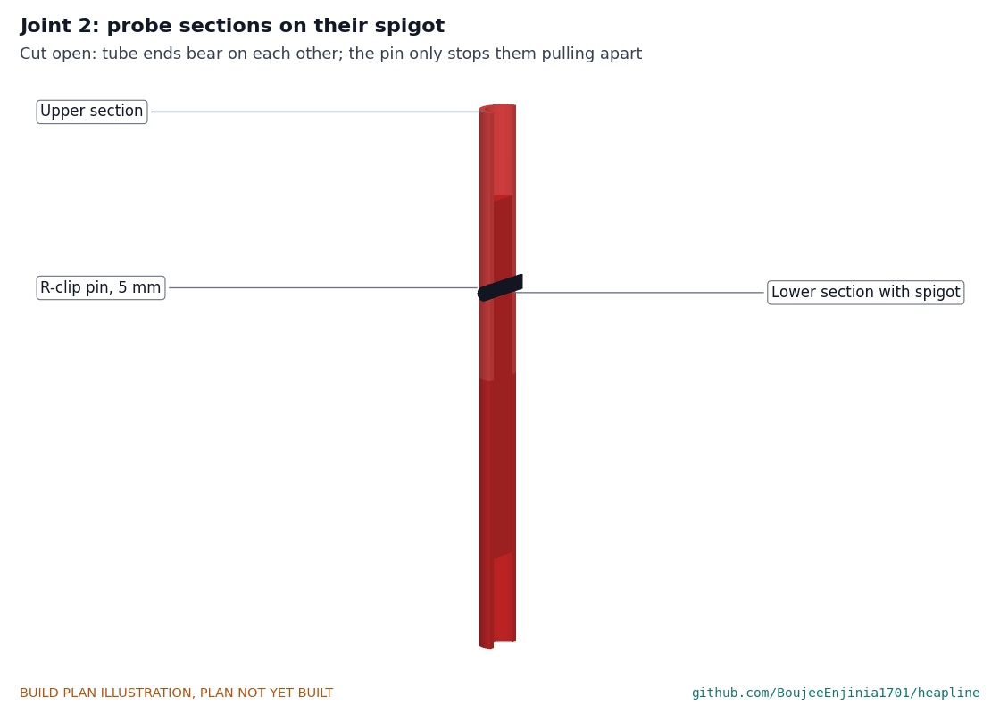

*Figure 6. Joint 2, cut open. The tube ends bear on each other when the probe is pushed; the R-clip only stops the sections pulling apart.*

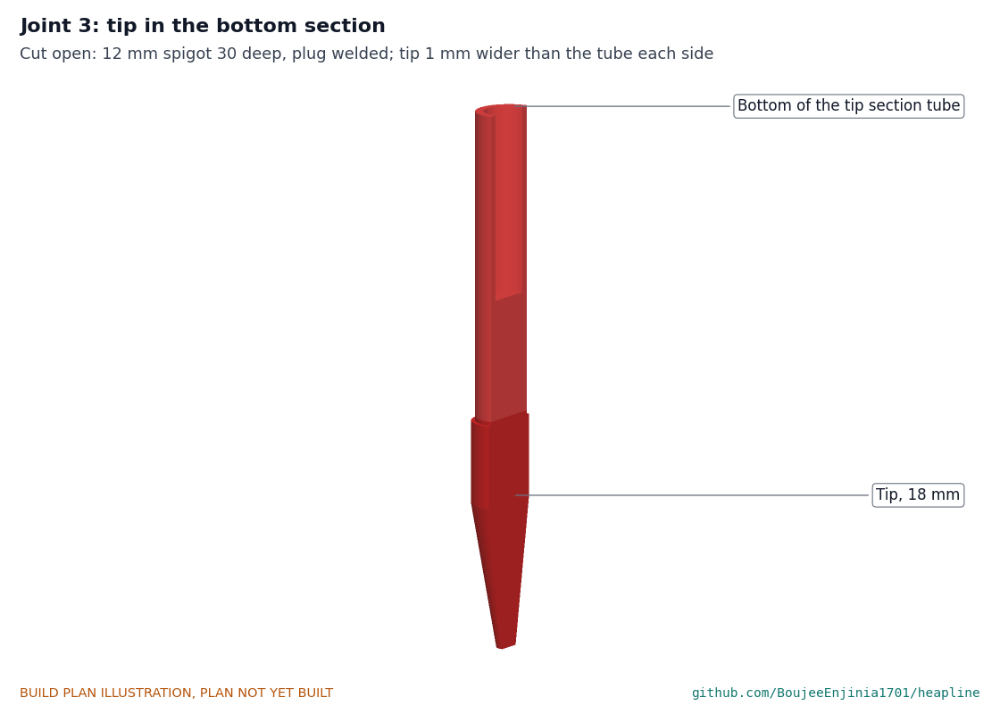

*Figure 7. Joint 3, cut open. The tip is 3 mm wider than the tube each side, so the tube behind it rubs less.*

**Check before moving on.** Each probe is 3068 long assembled and straight within 10 mm; the sections of any probe fit any other.

### 3.4 Capstan base frame with post

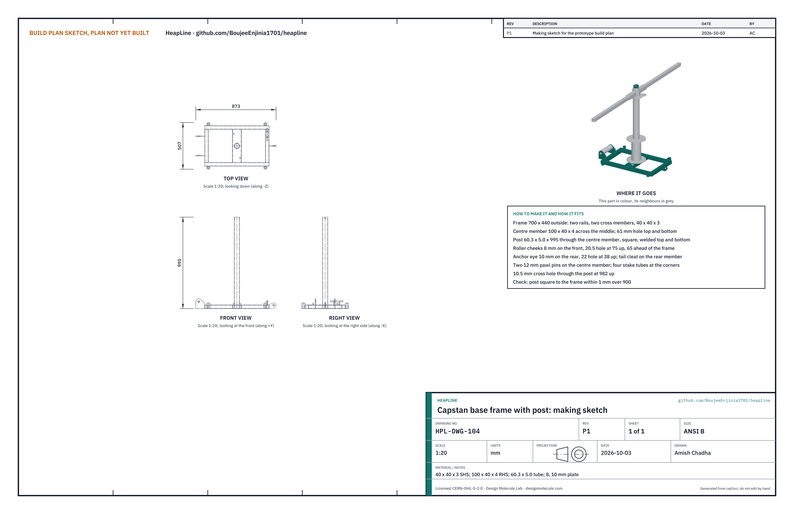

*Figure 8. Capstan base frame making sketch (HPL-DWG-104).*

**What it is and what it is made from.** The welded base that carries everything else. 40 x 40 x 3 steel square tube; 100 x 40 x 4 rectangular tube; 60.3 x 5.0 tube; 8 and 10 mm plate; 33.7 x 3.2 tube; 12 and 16 mm bar.

**How to make it.**

1. Cut and weld a rectangular frame 700 long and 440 wide outside from the 40 tube.
2. Cut the 100 x 40 centre member to fit across the middle and drill a 61 mm hole through its top and bottom faces, centred.
3. Weld the centre member in. Push the 995 post through both holes until its foot is flush with the bottom face, check it square to the frame both ways, and weld it all round at the top and bottom faces.
4. Weld two 8 mm roller cheeks to the front member's outer face, 202 apart inside, with 20.5 holes 75 up and 65 ahead of the frame.
5. Weld the 10 mm anchor eye to the middle of the rear member's outer face, its 22 hole 38 up and 50 behind the frame.
6. Weld the tail cleat (two 12 mm posts and a 16 mm horn) on the rear member, toward one side.
7. Weld two 12 mm pawl pins upright on the centre member at the positions on the sketch, and four stake tubes 60 long to the rail outsides at the corners.
8. Drill a 10.5 mm cross hole through the post 982 up.

**How it fits the parts next to it.**

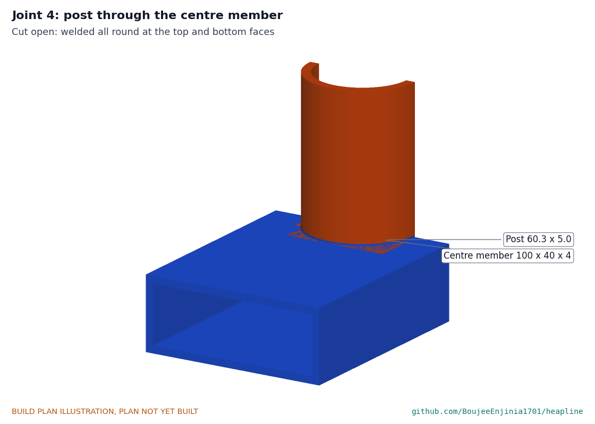

*Figure 9. Joint 4, cut open. The post passes through both faces of the centre member and is welded at each; the two welds carry the bending from the rope.*

**Check before moving on.** The post is square to the frame within 1 mm over 900; the frame sits flat without rocking.

### 3.5 Drum with holding ratchet

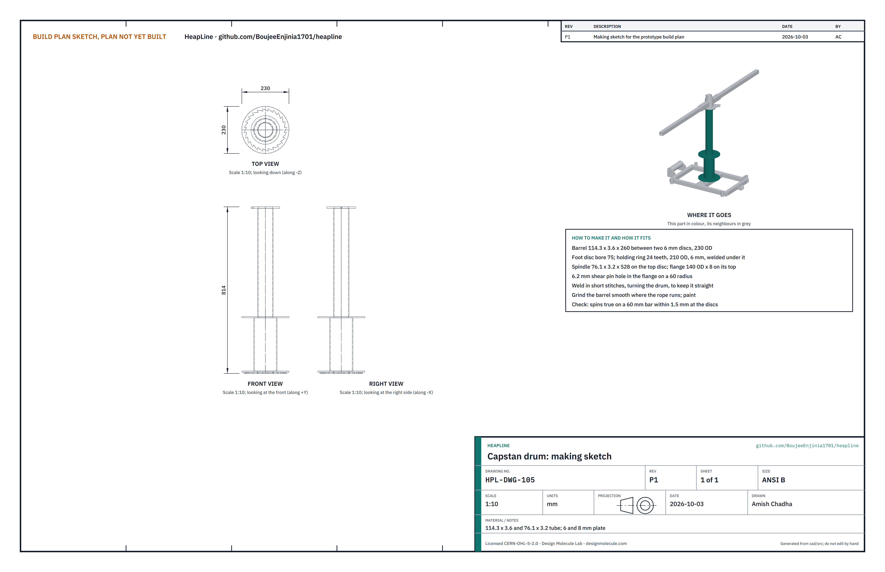

*Figure 10. Drum making sketch (HPL-DWG-105).*

**What it is and what it is made from.** The drum the rope wraps round, with its holding ring and the spindle that carries it up to the head. 114.3 x 3.6 and 76.1 x 3.2 tube; 6 and 8 mm plate, the ring profile cut.

**How to make it.**

1. Have the holding ring (24 teeth, 210 outside, 75 bore, 6 mm) and two 230 discs profile cut; bore the foot disc 75 and the top disc 70.
2. Cut the barrel 260 long and the spindle 528 long.
3. Weld the discs to the barrel ends, square, then the spindle centred on the top disc and the 140 x 8 flange on the spindle top.
4. Weld the ring under the foot disc, teeth facing the way the sketch shows.
5. Drill the 6.2 shear pin hole through the flange on a 60 radius.
6. Weld in short stitches, turning the drum between them, and grind the barrel smooth where the rope runs.

**How it fits the parts next to it.**

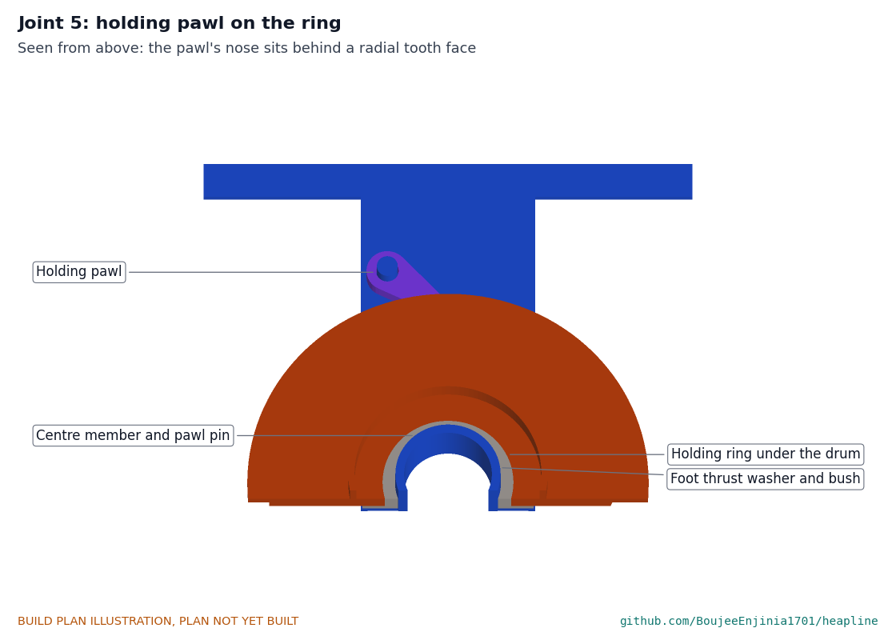

*Figure 11. Joint 5, seen from above. Each holding pawl's nose drops behind a radial tooth face, so the drum cannot turn back.*

**Check before moving on.** On a 60 mm bar the drum spins true within 1.5 mm at the discs.

### 3.6 Drive ratchet wheel

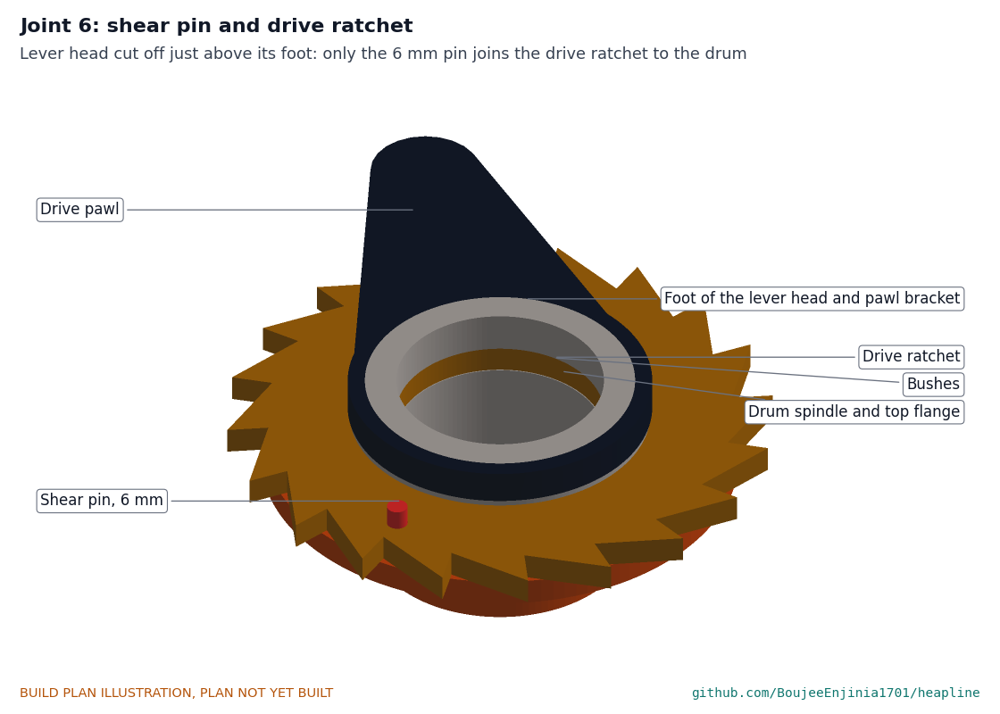

*Figure 12. Joint 6, cut open. The drive ratchet sits on the drum's top flange and is joined to it only by the 6 mm shear pin; the lever head turns on its own bush above.*

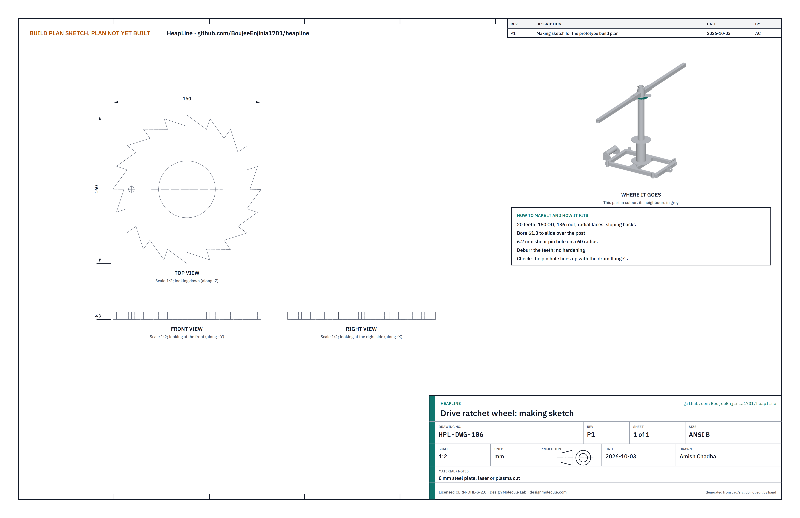

*Figure 13. Drive ratchet making sketch (HPL-DWG-106).*

**What it is and what it is made from.** The wheel the drive pawl pushes. 8 mm steel plate, profile cut: 20 teeth, 160 outside, bore 61.3.

**How to make it.** Have it profile cut; deburr the teeth; drill the 6.2 shear pin hole on a 60 radius, matched to the drum flange. Do not harden it.

**Check before moving on.** It slides over the post; its pin hole lines up with the flange's.

### 3.7 Lever head

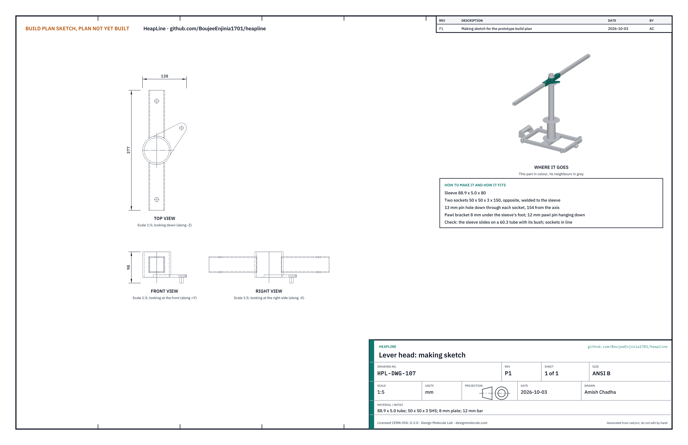

*Figure 14. Lever head making sketch (HPL-DWG-107).*

**What it is and what it is made from.** The part the bars plug into, carrying the drive pawl. 88.9 x 5.0 tube 80 long; two 50 x 50 x 3 tube sockets 150 long; 8 mm plate; 12 mm bar.

**How to make it.**

1. Saddle the inner end of each socket to the sleeve and weld them on opposite sides, in line.
2. Drill a 13 hole down through each socket, 154 from the axis.
3. Weld the 8 mm pawl bracket under the sleeve's foot and the 12 mm pawl pin hanging down from it.

**How it fits the parts next to it.**

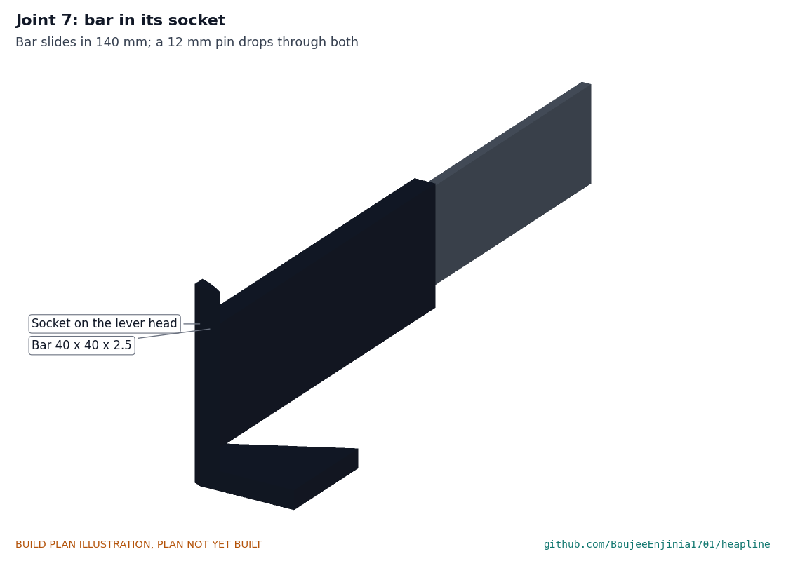

*Figure 15. Joint 7. Each bar slides 140 into its socket; a 12 mm pin drops through both.*

**Check before moving on.** With its bush pressed in, the sleeve slides on a 60.3 tube; the sockets are in line within 2 degrees.

### 3.8 Pawls (make 3)

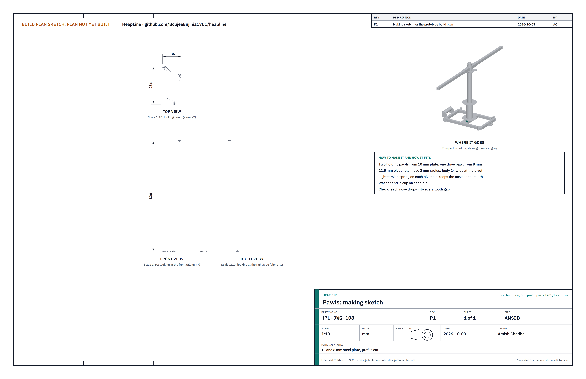

*Figure 16. Pawls making sketch (HPL-DWG-108).*

**What it is and what it is made from.** Two holding pawls from 10 mm plate and one drive pawl from 8 mm plate, profile cut, with 12.5 mm pivot holes; a light torsion spring for each.

**How to make it.** Have them profile cut; break the edges; check the noses are crisp.

**How it fits the parts next to it.** See Figures 11 and 12: each pawl hangs on its 12 mm pin with its spring, a washer and an R-clip, its nose on the teeth.

**Check before moving on.** Each nose drops into every tooth gap as the wheel is turned by hand.

### 3.9 Capstan bars and pins

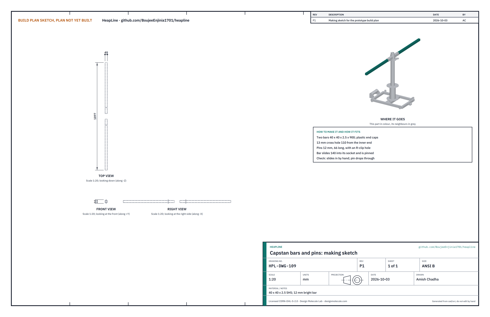

*Figure 17. Capstan bars making sketch (HPL-DWG-109).*

**What it is and what it is made from.** Two 900 long bars of 40 x 40 x 2.5 tube with 13 cross holes 110 from the inner end; two 12 mm pins 66 long with R-clips; plastic end caps.

**Check before moving on.** Each bar slides into either socket by hand and its pin drops through.

### 3.10 Bushes and thrust washers

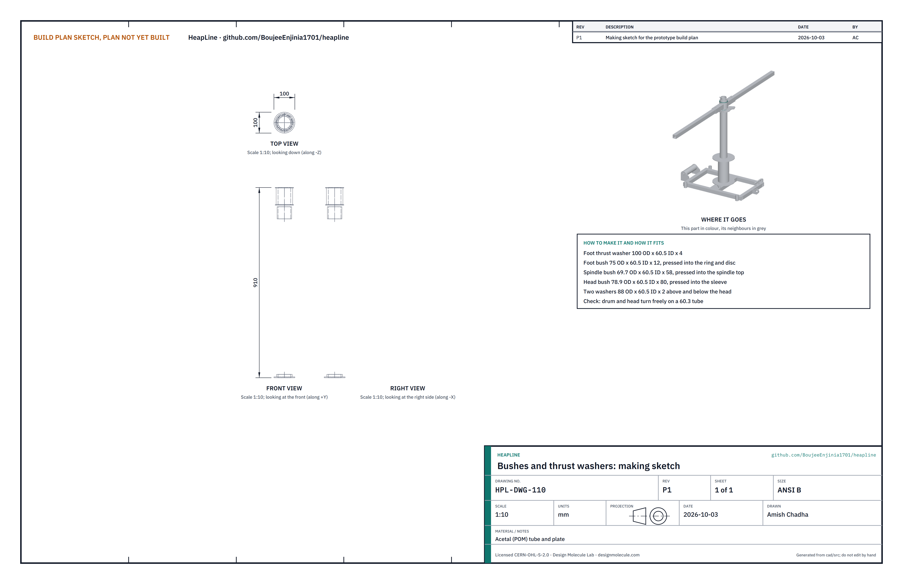

*Figure 18. Bushes and thrust washers making sketch (HPL-DWG-110).*

**What it is and what it is made from.** Acetal (POM) bushes that the drum and head turn on: a foot thrust washer 100 x 60.5 x 4; a foot bush 75 x 60.5 x 12; a spindle bush 69.7 x 60.5 x 58; a head bush 78.9 x 60.5 x 80; two washers 88 x 60.5 x 2.

**How to make it.** Turn them from acetal stock. Press the foot bush into the ring and foot disc, the spindle bush into the spindle top and the head bush into the sleeve.

**Check before moving on.** Drum and head each turn freely by hand on a 60.3 tube.

### 3.11 Hold-down roller, pin and keeper

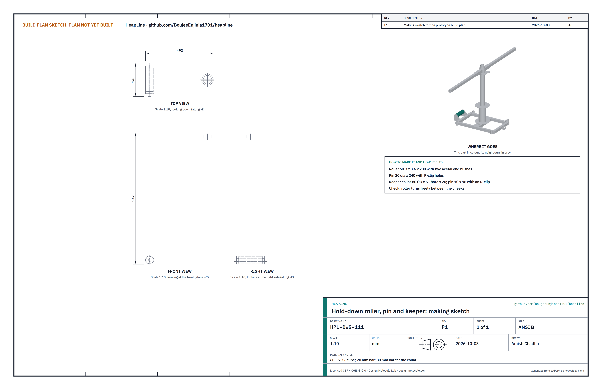

*Figure 19. Hold-down roller, pin and keeper making sketch (HPL-DWG-111).*

**What it is and what it is made from.** The roller the rope runs under: 60.3 x 3.6 tube 200 long with acetal end bushes on a 20 mm pin 240 long. The keeper: a collar 80 x 61 x 20 and a 10 mm pin 96 long, both with R-clips.

**How it fits the parts next to it.**

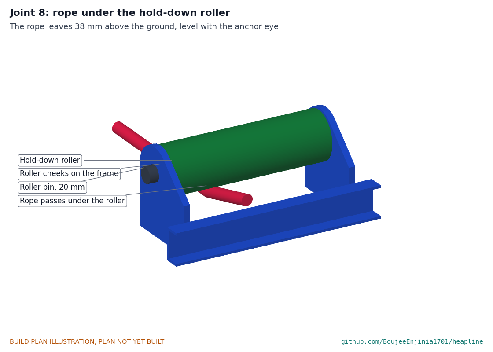

*Figure 20. Joint 8. The rope comes down from the drum and passes under the roller, leaving 38 mm above the ground, level with the anchor eye.*

**Check before moving on.** The roller turns freely between the cheeks.

### 3.12 Ground stakes (make 4)

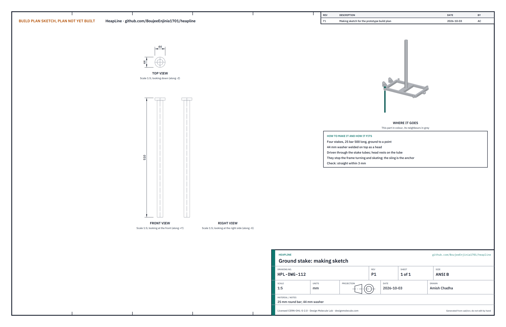

*Figure 21. Ground stake making sketch (HPL-DWG-112).*

**What it is and what it is made from.** 25 mm round bar 500 long, ground to a point, with a 44 mm washer welded on top as a head. Driven through the stake tubes until the heads rest on them. They stop the frame turning against the pawls; they are not the anchor.

**How it fits the parts next to it.**

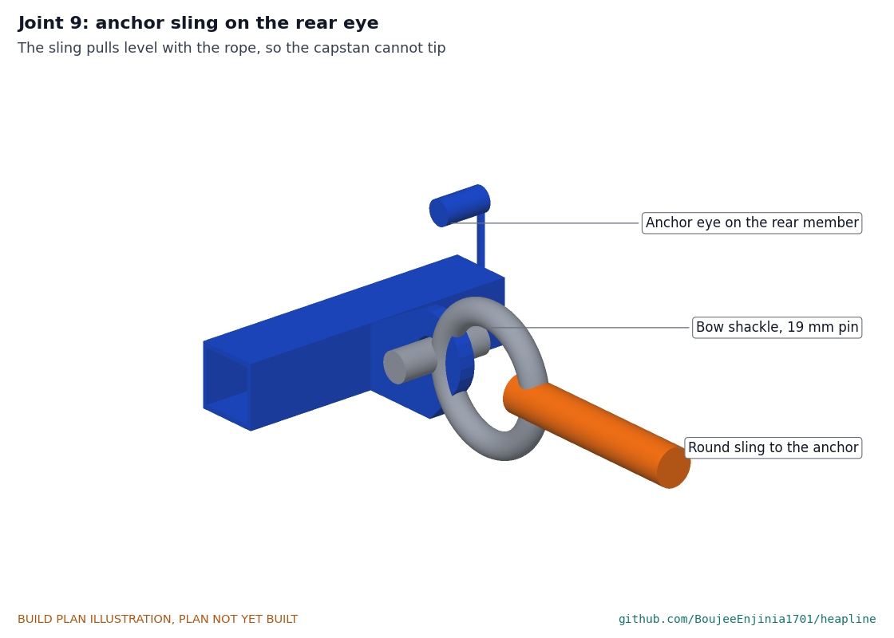

*Figure 22. Joint 9. A bow shackle's 19 mm pin goes through the 22 mm hole in the anchor eye; the round sling runs from the shackle to the anchor, level with the rope.*

**Check before moving on.** Each stake is straight within 3 mm.

### 3.13 Sheet clamp

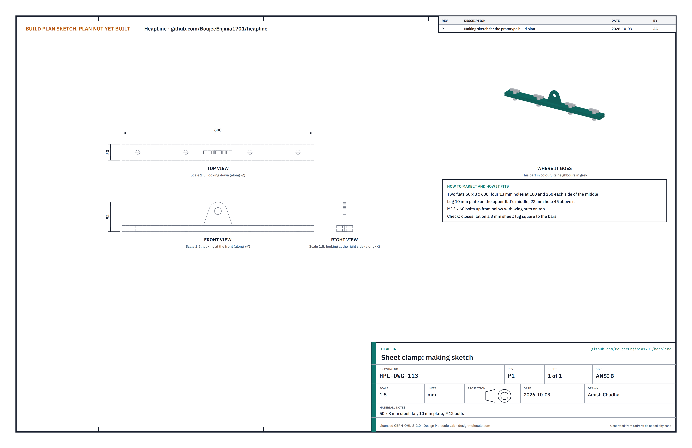

*Figure 23. Sheet clamp making sketch (HPL-DWG-113).*

**What it is and what it is made from.** Two 50 x 8 steel flats 600 long; a 10 mm lug plate; four M12 x 60 bolts with wing nuts and washers.

**How to make it.**

1. Clamp the two flats together and drill four 13 holes through both, at 100 and 250 each side of the middle.
2. Weld the lug to the middle of the upper flat, square, its 22 hole 45 above the flat.

**How it fits the parts next to it.**

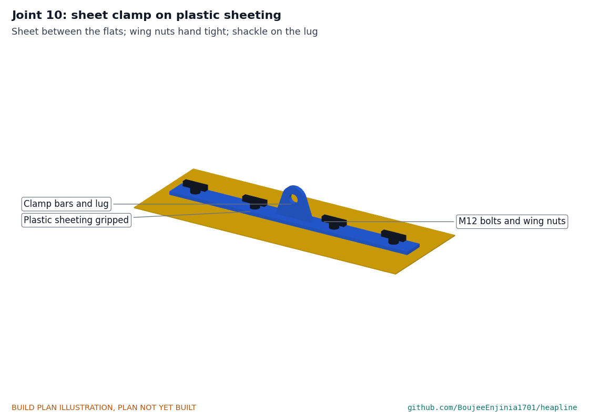

*Figure 24. Joint 10. The sheeting lies between the flats; the bolts pass up through the sheet and the wing nuts are hand tight. The rope's shackle goes on the lug.*

**Check before moving on.** The flats close flat on a 3 mm sheet.

### 3.14 Sheet stretcher

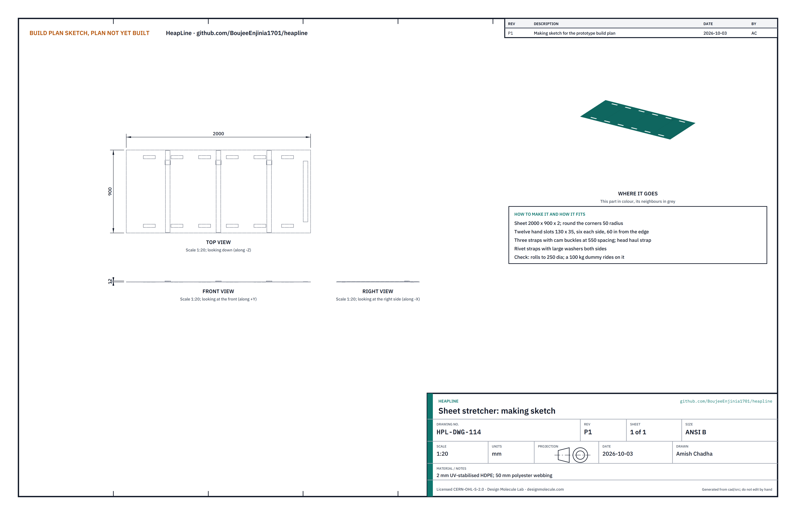

*Figure 25. Sheet stretcher making sketch (HPL-DWG-114).*

**What it is and what it is made from.** 2 mm UV-stabilised HDPE sheet 2000 x 900; 50 mm polyester webbing; cam buckles; rivets with large washers.

**How to make it.**

1. Cut the sheet and round the corners to 50 radius.
2. Cut twelve hand slots 130 x 35, six along each long edge, 60 in from the edge, and smooth their edges.
3. Rivet three straps across the sheet at 550 spacing, with a cam buckle on one end of each, and a haul strap across the head end.

**Check before moving on.** The sheet rolls to about 250 diameter and lies flat again.

### 3.15 Site box body

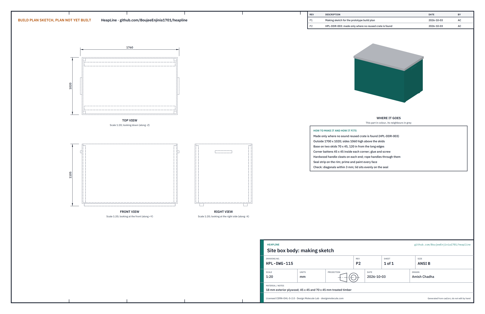

*Figure 26. Site box body making sketch (HPL-DWG-115).*

**What it is and what it is made from.** The box the kit lives in at the shed. 18 mm exterior plywood; 45 x 45 and 70 x 45 treated timber; exterior glue, screws and paint.

**How to make it.**

1. Cut the base 1700 x 1020 and screw two skids under it, 120 in from the long edges.
2. Cut two sides 1700 long and two ends to fit between them, all 1042 high; glue and screw them to the base and to 45 x 45 corner battens inside each corner.
3. Fix a hardwood handle cleat to each end and thread a rope handle through it.
4. Fix the EPDM seal strip round the top rim; prime and paint every face, cut edges first.

**Check before moving on.** The diagonals of the top are equal within 3 mm.

### 3.16 Site box lid

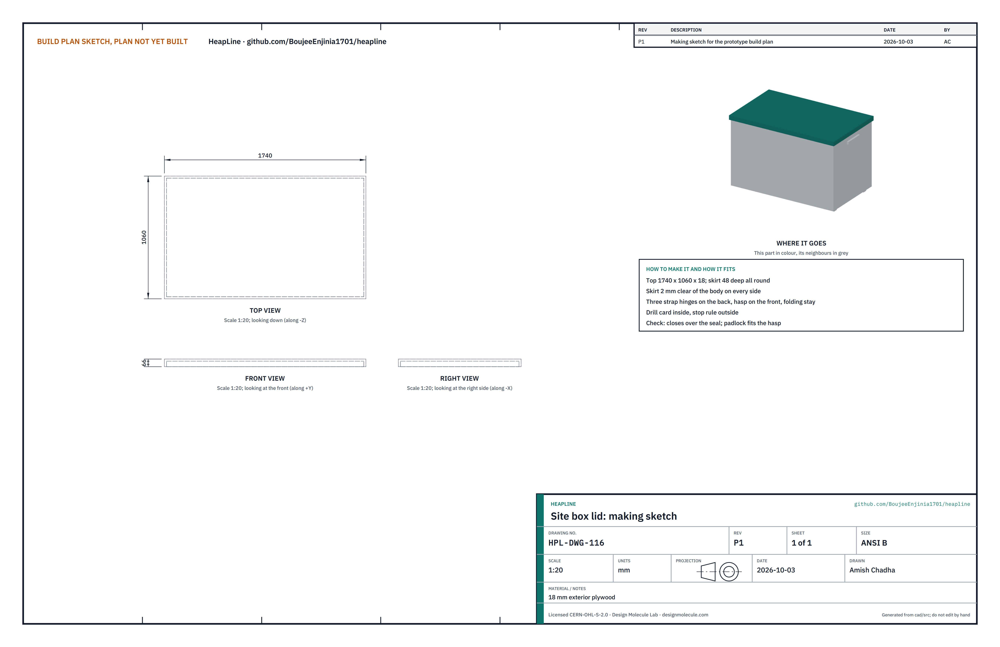

*Figure 27. Site box lid making sketch (HPL-DWG-116).*

**What it is and what it is made from.** 18 mm exterior plywood: a top 1740 x 1060 and a skirt 48 deep all round, 2 clear of the body.

**How to make it.** Glue and screw the skirt under the top's edges; paint; fit three strap hinges on the back, the hasp on the front and a folding steel stay; apply the drill card inside and the stop rule outside.

**How it fits the parts next to it.**

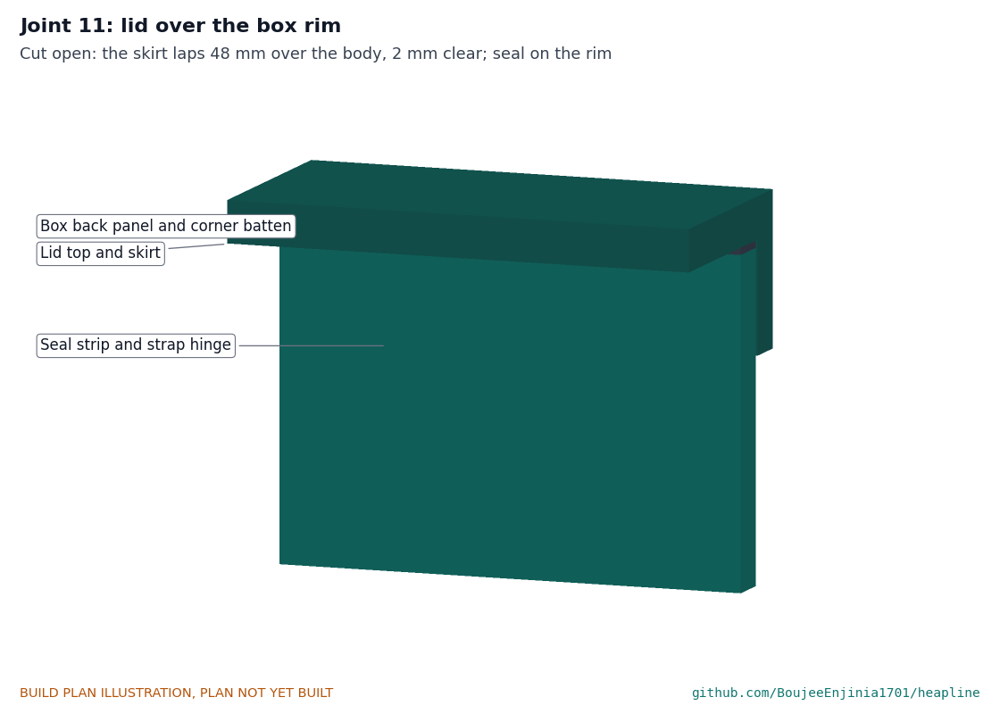

*Figure 28. Joint 11, cut open at the back. The lid sits on the seal and its skirt laps 48 down over the body, so rain runs off outside.*

**Check before moving on.** The lid closes evenly on the seal and the padlock fits the hasp.

### 3.17 Bought components

Buy to specification, not brand. Line numbers are those of the bill of materials.

- **Box hardware (line 3).** Three 300 galvanised strap hinges, a heavy hasp and staple, a shrouded weatherproof combination padlock, a folding steel lid stay, 5.5 m of 10 x 3 EPDM seal, rope for handles.
- **Probe pins (line 7).** R-clips for a 5 mm hole on short lanyards.
- **Shovels (line 8).** Four long-handled round-point steel shovels about 1.45 m long.
- **Shear pins (line 18).** 6 mm S275 bright mild steel bar cut 32 long with split pins; never hardened steel and never a bolt.
- **Club hammer (line 19).** 1.8 kg.
- **Rope (line 20).** 30 m of 14 mm polyester double braid, minimum breaking strength at least 40 kN, with one eye splice and thimble at the load end.
- **Slings and shackles (line 21).** Two polyester round slings WLL 2,000 kg (3 m and 2 m), three bow shackles WLL 2,000 kg with 19 mm pins, a tree protector strap.
- **Lookout kit, lighting, PPE, cards, bags, fasteners and paint (lines 24 to 30).** As listed in the bill of materials; the lamps take AA alkaline cells, and no lithium cells go in the box.

## 4. Putting it together

In each picture the parts already fitted are grey and the part being fitted is in colour, with an arrow showing the way it goes in. Steps 1 to 11 are done in the workshop; steps 12 to 15 are the drill on a practice heap that cannot move. Two people for the capstan steps.

### Step 1: bushes and washers onto the post

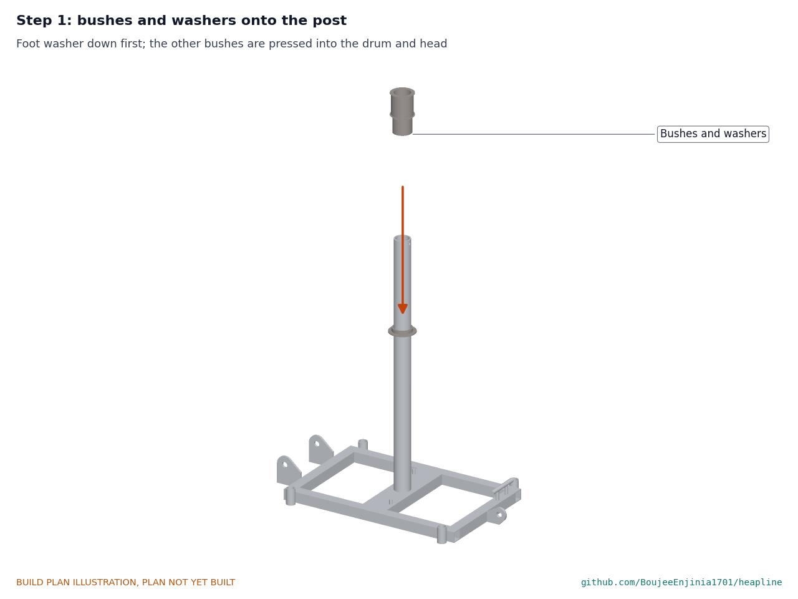

Drop the foot thrust washer over the post onto the centre member. The other bushes are already pressed into the drum and the head (section 3.10). Grease the post lightly.

### Step 2: lower the drum over the post

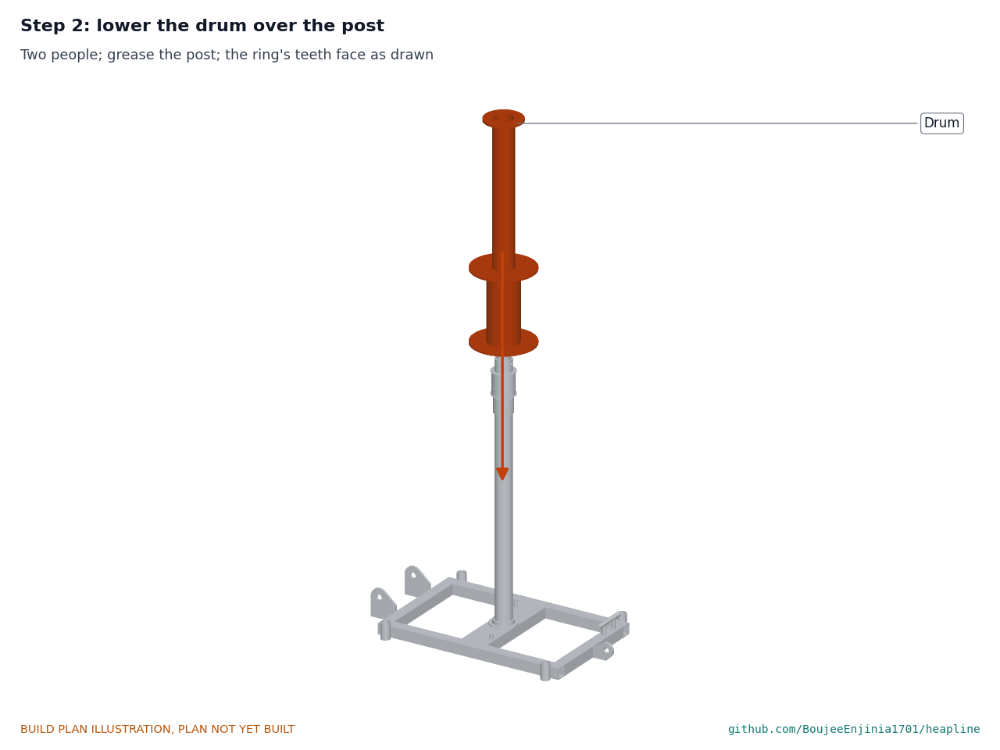

Two people lift the drum (11 kg) and lower it over the post until the ring sits on the thrust washer. It should turn freely by hand.

### Step 3: holding pawls onto their pins

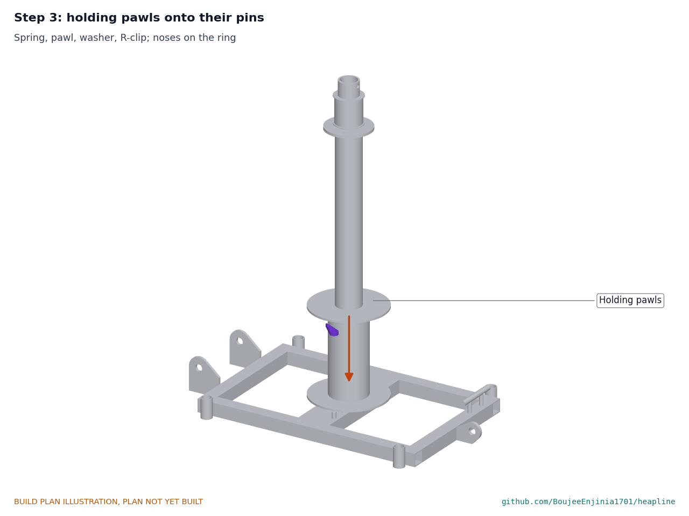

Fit each holding pawl's spring, then the pawl, a washer and an R-clip. Turn the drum in the haul direction: the pawls click. Try to turn it back: they hold.

### Step 4: drive ratchet and shear pin

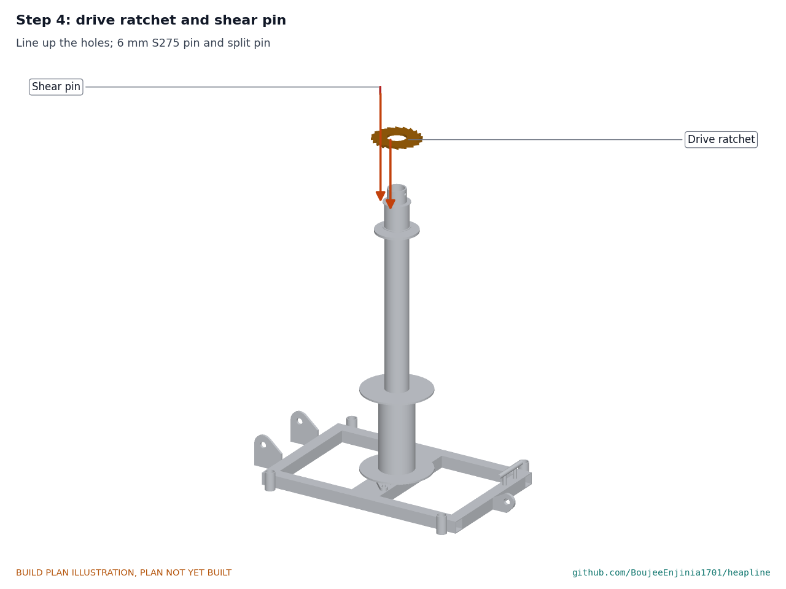

Slide the drive ratchet over the post onto the drum's top flange and line up the pin holes. Fit a 6 mm S275 shear pin and its split pin. Hang the spare pins on the tag chain on the frame.

### Step 5: lever head onto the post

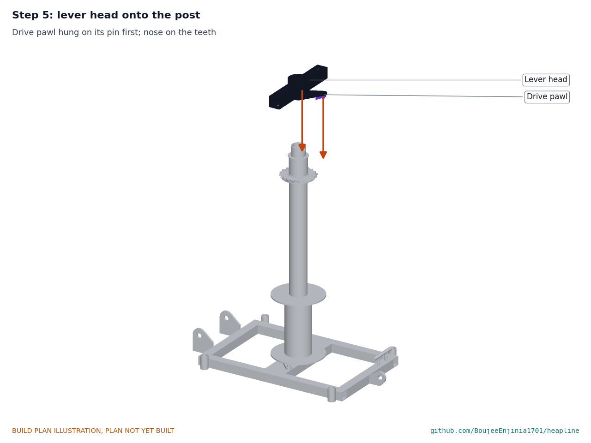

Hang the drive pawl and its spring on the head's pin. Fit the lower washer, then lower the head over the post until it rests on the ratchet, with the pawl's nose on the teeth.

### Step 6: keeper collar and pin

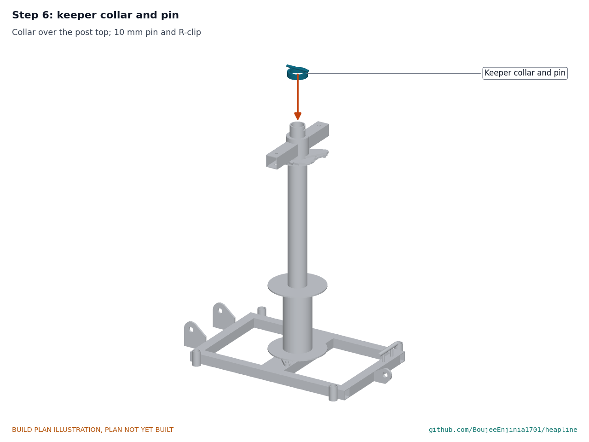

Fit the upper washer and the keeper collar over the post top and push the 10 mm pin through the cross hole; R-clip it.

### Step 7: hold-down roller between the cheeks

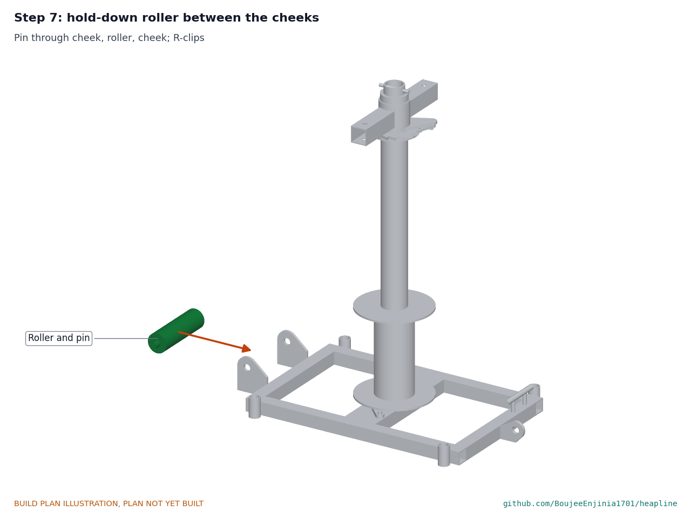

Hold the roller between the cheeks, push the 20 mm pin through cheek, roller and cheek, and R-clip both ends.

### Step 8: bars into the sockets

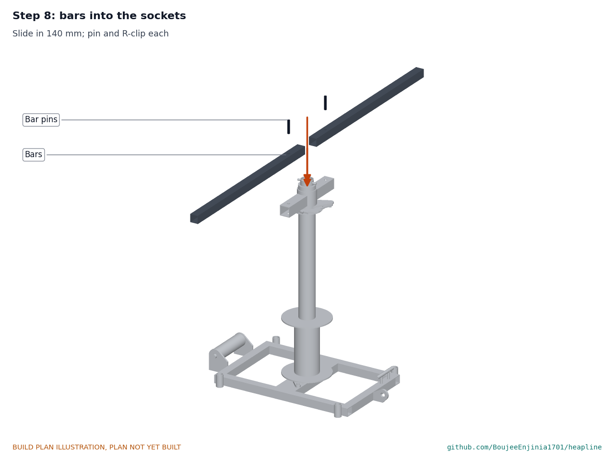

Slide each bar 140 into its socket and drop its pin through; R-clip. Pump the bars through a quarter turn and back: the drum turns one way only.

### Step 9: join the probe sections

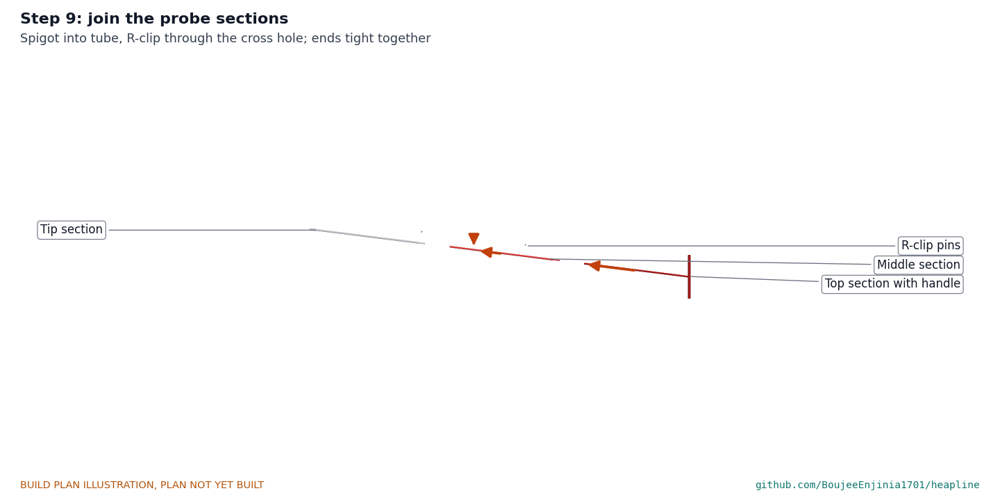

Push the middle section over the tip section's spigot until the tube ends meet and fit the R-clip; then the top section. Take them apart again for storage.

### Step 10: link two boards end to end

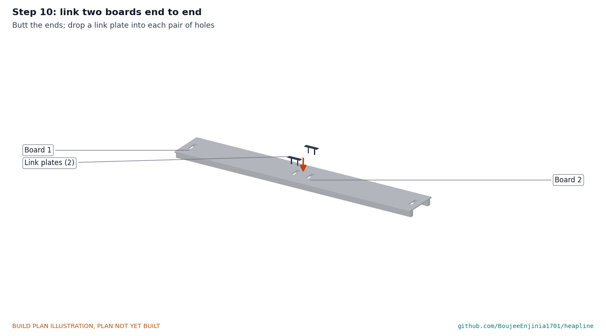

Butt two boards end to end and drop a link plate into each pair of holes.

### Step 11: pack the site box

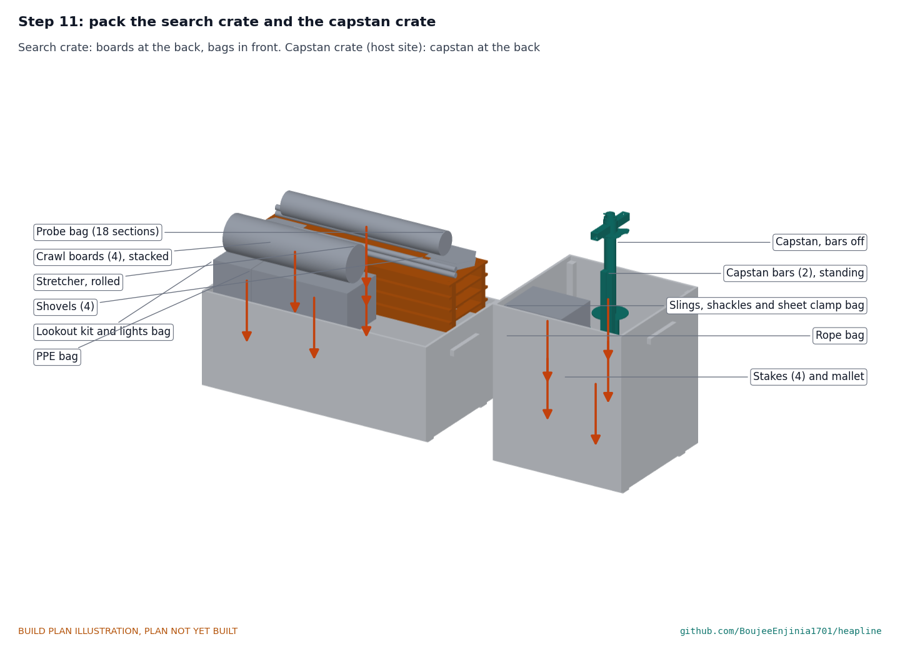

Pack in this order: the four boards flat at the back; the capstan upright at the front right with its bars off and its stakes out; the rope bag, the slings and clamp bag, the stakes and hammer, and the lookout, lamps and PPE bags at the front left; then on the boards the shovels, the probe bag, the bars and the rolled stretcher. Close the lid and lock it.

### Step 12: lookout posted, boards laid

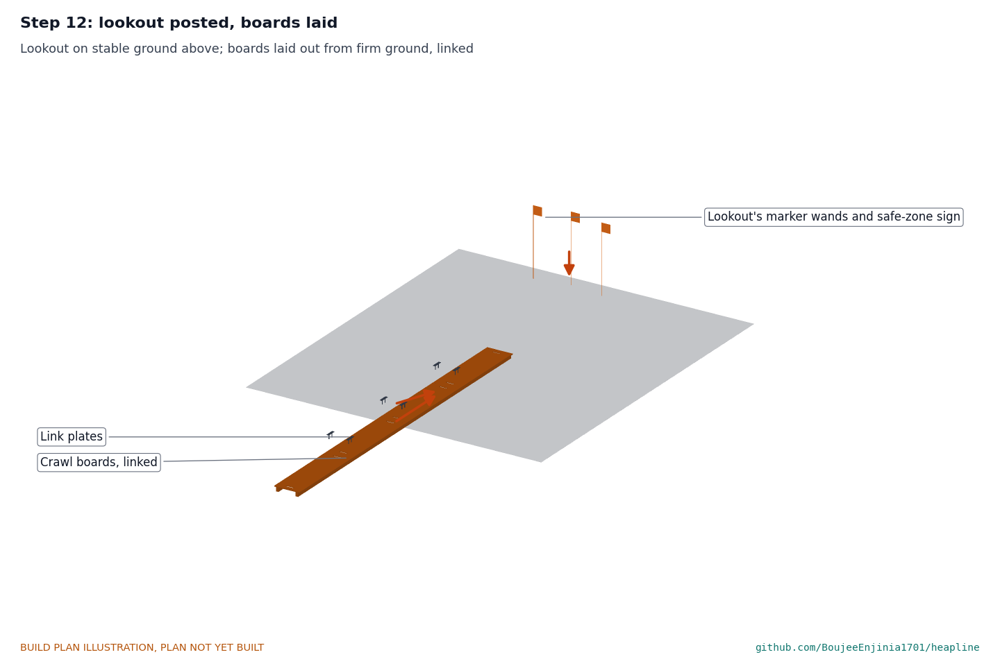

On the practice heap, post the lookout first on firm ground to the side, with the whistle and the safe-zone sign. Lay the boards out from firm ground and link them.

### Step 13: probe line from the boards

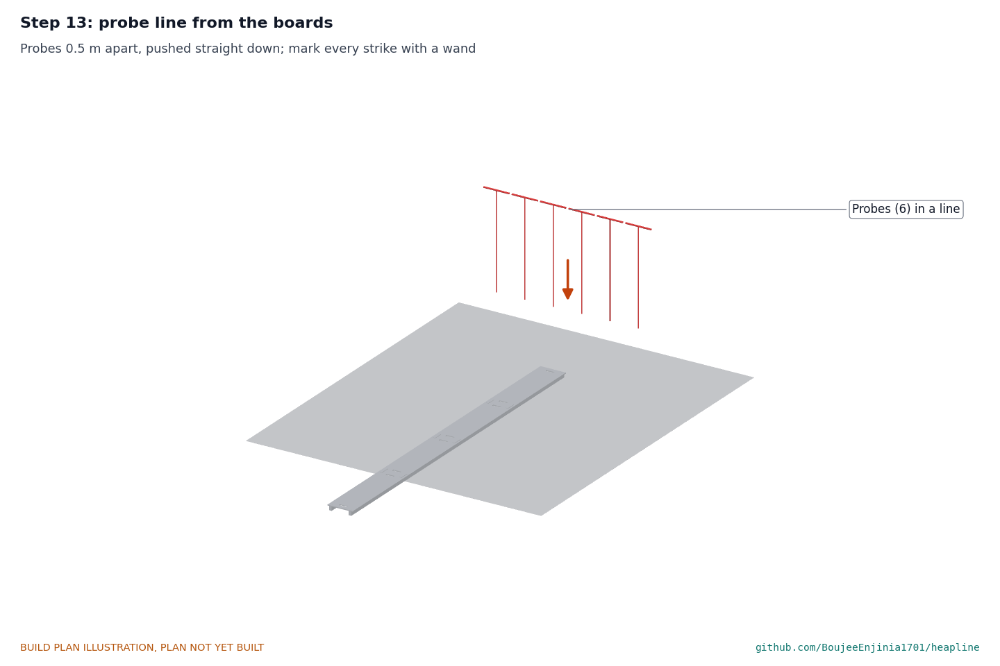

Join the probes and push them straight down in a line about 0.5 m apart from the boards. Mark every strike with a flagged wand.

### Step 14: set the capstan on firm ground

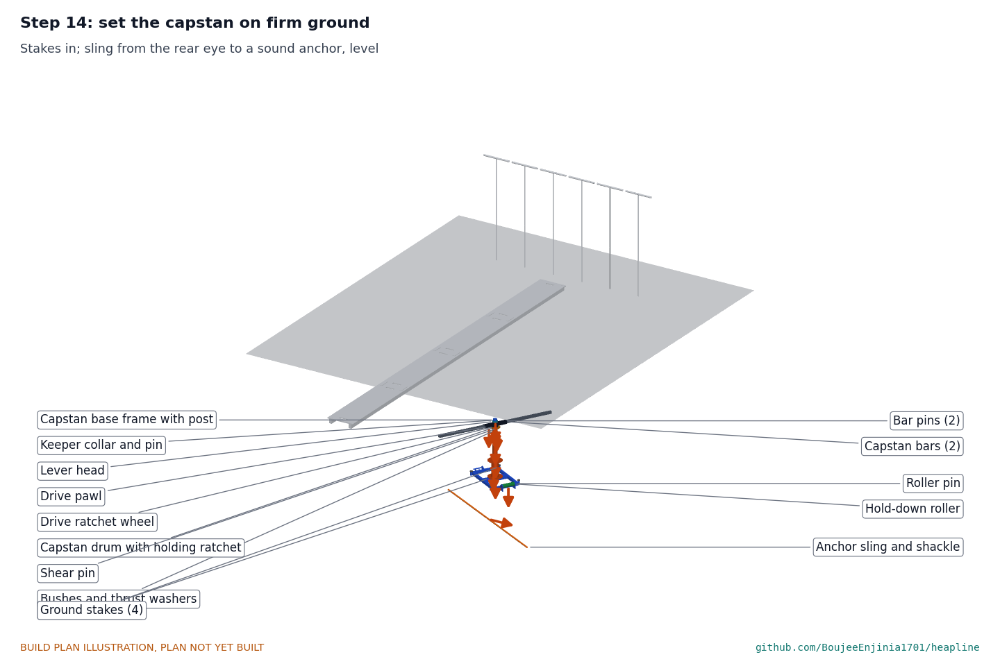

Set the capstan on firm level ground to the side of the boards, its roller toward the load. Drive the four stakes. Sling the rear eye to a sound tree, a parked vehicle's recovery point or a structural column, low, so the sling runs level.

### Step 15: rig the clamp; stretcher alongside

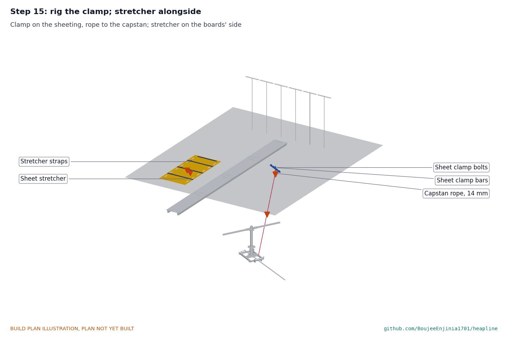

Clamp the sheet clamp on the sheeting and shackle the rope's eye to its lug. Lead the rope back under the roller, take four turns round the drum and hand the tail to the tailer. Lay the stretcher beside the boards. Clear the rope line (section 6) before the first stroke.

## 5. First checks

These are listed here and recorded in a TRL 4 test report, not in this plan.

*Table 2. First checks.*

| Check | Requirement | How | Pass when |
| --- | --- | --- | --- |
| Deployment drill | R1 | Timed from a whistle 100 m from the shed | First probe in within 5 min |
| Probe reach | R2 | Probes pushed by one and by two people on a test heap of mixed waste, loose and compacted | Depth reached recorded against the 2.5 m target |
| Board sinkage | R3 | 100 kg on a board on loose fill; then across a 0.8 m gap | Sinkage under 50 mm; no cracking |
| Capstan pull | R4 | Pull through a load cell with four people | 5 kN reached |
| Shear pin release | R10 | Pull against a fixed stop through a load cell, slowly | Pin shears between 5.1 and 7.6 kN; a pawl holds the drum |
| Holding | R11 | At working pull, let go of the bars | Drum stops within one tooth |
| Proof load of capstan and sling | R10 | CalRig or a load cell, held 1 min at 8 kN, nobody in the rope line | No movement over 2 mm, no damage |
| Stretcher haul | R5 | 100 kg manikin over 30 m of debris, two and four haulers | Record force and time |
| Stop rule | R6 | Ask every drill participant after the drill | All six signals named |
| Storage | R7 | Inspect after 12 months in the box | Everything usable |
| Weighing | R8 | Weigh every carried item | Each 25 kg or less; record the carry split |

## 6. Safety stops

Work stops at each of these points until what is listed is true.

1. **Before any drill.** The practice heap cannot slide: it is low, on flat ground, and nobody is in or under it. A lookout is posted and the stop rule has been read out. The fire service has been told about the drill.
2. **Before stepping onto debris.** A lookout is on stable ground to the side with a whistle; the safe zone is marked to the side of the slide path, never below it; everyone wears gloves and boots; nobody smokes.
3. **Before any rope is loaded.** The capstan stands on firm natural ground, not waste. The four stakes are in. The sling goes to a sound anchor (a tree at least 200 mm across at its base, a parked and braked vehicle's recovery point, or a structural column), runs level and is shackled to the rear eye. A 6 mm S275 shear pin is fitted, never a bolt or a harder pin. Both holding pawls are down on the teeth.
4. **Before each pull.** Nobody stands in the line of the rope, within 2 m of it, or between the load and the dig. The load is sheeting, timber or debris pulled sideways away from the dig; the capstan never lifts and never pulls on a person. The tailer stands behind the capstan, outside the bars' swing.
5. **Whenever hauling stops.** The tail is made fast on the cleat and the pawls are holding before anyone lets go.
6. **After a shear pin breaks.** Stop. Slack the rope by lifting the pawls one tooth at a time with the bars held. Find out why it broke; fit a new pin of the same 6 mm S275 bar from the tag chain.
7. **On any stop signal.** Everyone leaves the debris along the boards to the safe zone at once, whatever they are doing.
8. **At the end of each drill and at each monthly inspection.** Inspect the rope, splice, slings, shackles, pawls, pins, boards and probes; replace anything cut, cracked, bent or worn; check the lamp cells and the padlock.

## 7. Tools, skills and workspace

- MIG welder (or a small stick welder with 2.5 mm electrodes) and a person who can weld 2 and 3 mm tube square; welding screen, gloves and mask.
- Angle grinder, metal saw, pillar drill with bits to 22 mm and a 61 mm hole saw; a lathe or a machine shop for the probe tips and the acetal bushes.
- Laser or plasma profile cutting for the ratchets and pawls, from a local cutter.
- Circular saw or table saw, jigsaw, drill and screwdriver for the plywood; clamps; exterior glue.
- Rivet tool for the stretcher; spanners for M12; R-clip pliers.
- A flat floor or welding table about 1.2 x 1.0 m; a floor 2 x 2 m for the box; two people for the drum, frame and box.
- Rope work: the eye splice in double braid made by a rigger, or bought made.

## 8. Where the numbers come from

- `cad/src/model.py`: the parametric model, its constructability and packing checks, and the STEP and STL files in `cad/step` and `cad/stl`.
- `cad/drawings/HPL-DWG-001` and `HPL-DWG-002`: general arrangement of the capstan and the packed site box; `HPL-DWG-101` to `HPL-DWG-116`: making sketches.
- `docs/04-calcs/01-sizing.md` and `docs/04-calcs/sizing.py` (HPL-CAL-001): forces, strengths, masses, times and costs.
- `bom/bom.csv`: parts, specifications and prices.
- `docs/decisions/0002-design-for-construction.md` (HPL-DDR-002): the changes in section 2.
- `cad/src/build_plan_media.py`: every picture in this plan.
